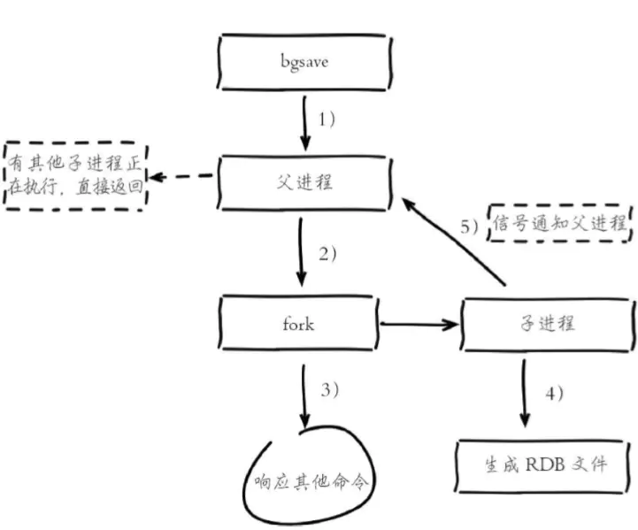

# Redis

## 1. Redis持久化

redis持久化有两种方式，`RDB`和`AOF`

### 1.1 RDB（Redis DataBase）

> RDB持久化将Redis数据以快照的方式写到二进制文件中，默认的文件名为`dump.rdb`，有手动触发和自动触发两种方式。

#### 1.1.1 手动触发分为两种,save和bgsave

- save

  阻塞当前Redis服务器，直到RDB过程完成为止，对于内存 比较大的实例会造成长时间阻塞，线上环境不建议使用

- bgsave

  Redis进程执行fork操作创建子进程，RDB持久化过程由子 进程负责，完成后自动结束。阻塞只发生在fork阶段，一般时间很短

  执行流程：

  

  1. 执行bgsave命令，Redis父进程判断当前是否存在正在执行的子进 程，如RDB/AOF子进程，如果存在bgsave命令直接返回。
  2. 父进程执行fork操作创建子进程，fork操作过程中父进程会阻塞，通 过info stats命令查看latest_fork_usec选项，可以获取最近一个fork操作的耗时，单位为微秒
  3. 父进程fork完成后，bgsave命令返回“Background saving started”信息并不再阻塞父进程，可以继续响应其他命令。
  4. 子进程创建RDB文件，根据父进程内存生成临时快照文件，完成后 对原有文件进行原子替换。执行lastsave命令可以获取最后一次生成RDB的 时间，对应info统计的rdb_last_save_time选项。
  5. 进程发送信号给父进程表示完成，父进程更新统计信息，具体见 info Persistence下的rdb_*相关选项。

#### 1.1.2 自动触发

1. 自动触发是由我们的配置文件来完成的。在redis.conf配置文件中，里面有如下配置，我们可以去设置：

   ①save：这里是用来配置触发 Redis的 RDB 持久化条件，也就是什么时候将内存中的数据保存到硬盘。比如“save m n”。表示m秒内数据集存在n次修改时，自动触发bgsave。

   默认如下配置：

   \#表示900 秒内如果至少有 1 个 key 的值变化，则保存save 900 1#表示300 秒内如果至少有 10 个 key 的值变化，则保存save 300 10#表示60 秒内如果至少有 10000 个 key 的值变化，则保存save 60 10000

   不需要持久化，那么你可以注释掉所有的 save 行来停用保存功能。

   ②stop-writes-on-bgsave-error ：默认值为yes。当启用了RDB且最后一次后台保存数据失败，Redis是否停止接收数据。这会让用户意识到数据没有正确持久化到磁盘上，否则没有人会注意到灾难（disaster）发生了。如果Redis重启了，那么又可以重新开始接收数据了

   ③rdbcompression ；默认值是yes。对于存储到磁盘中的快照，可以设置是否进行压缩存储。

   ④rdbchecksum ：默认值是yes。在存储快照后，我们还可以让redis使用CRC64算法来进行数据校验，但是这样做会增加大约10%的性能消耗，如果希望获取到最大的性能提升，可以关闭此功能。

   ⑤dbfilename ：设置快照的文件名，默认是 dump.rdb

   ⑥dir：设置快照文件的存放路径，这个配置项一定是个目录，而不能是文件名。

   我们可以修改这些配置来实现我们想要的效果。因为第三种方式是配置的，所以我们对前两种进行一个对比：

.jpg)

#### 1.1.3 RDB的优缺点

- 优点
  1. RDB是一个紧凑压缩的二进制文件，代表Redis在某个时间点上的数据 快照。非常适用于备份，全量复制等场景。比如每6小时执行bgsave备份， 并把RDB文件拷贝到远程机器或者文件系统中（如hdfs），用于灾难恢复。
  2. Redis加载RDB恢复数据远远快于AOF的方式。
- 缺点
  1. RDB方式数据没办法做到实时持久化/秒级持久化。因为bgsave每次运 行都要执行fork操作创建子进程，属于重量级操作，频繁执行成本过高。在快照持久化期间修改的数据不会被保存，可能丢失数据
  2. RDB文件使用特定二进制格式保存，Redis版本演进过程中有多个格式 的RDB版本，存在老版本Redis服务无法兼容新版RDB格式的问题。
  3. 针对RDB不适合实时持久化的问题，Redis提供了AOF持久化方式来解决。

### 1.2 AOF（Append Only File）

> redis会将每一个收到的写命令都通过write函数追加到文件中。通俗的理解就是日志记录。以独立日志的方式记录每次写命令， 重启时再重新执行AOF文件中的命令达到恢复数据的目的。AOF的主要作用 是解决了数据持久化的实时性，目前已经是Redis持久化的主流方式。

#### 1.2.1 持久化原理

每当有一个写命令过来时，就直接保存在我们的AOF文件中。

.jpg)

#### 1.2.2 使用AOF

开启AOF功能需要设置配置：appendonly yes，默认不开启。AOF文件名 通过appendfilename配置设置，默认文件名是appendonly.aof。保存路径同 RDB持久化方式一致，通过dir配置指定。AOF的工作流程操作：命令写入 （append）、文件同步（sync）、文件重写（rewrite）、重启加载 （load）

.jpg)

#### 1.2.3 AOF三种触发方式

1. 每修改同步always：同步持久化 每次发生数据变更会被立即记录到磁盘 性能较差但数据完整性比较好

2. 每秒同步everysec：异步操作，每秒记录 如果一秒内宕机，有数据丢失

3. 不同no：从不同步

   .jpg)

#### 1.2.4 aof_buf（缓冲区）

1. AOF为什么把命令追加到aof_buf中？Redis使用单线程响应命令，如 果每次写AOF文件命令都直接追加到硬盘，那么性能完全取决于当前硬盘负 载。先写入缓冲区aof_buf中，还有另一个好处，Redis可以提供多种缓冲区同步硬盘的策略，在性能和安全性方面做出平衡

#### 1.2.5 重写AOF文件

1. AOF的方式也同时带来了另一个问题。持久化文件会变的越来越大。为了压缩aof的持久化文件。redis提供了bgrewriteaof命令。将内存中的数据以命令的方式保存到临时文件中，同时会fork出一条新进程来将文件重写。

   > 重写aof文件的操作，并没有读取旧的aof文件，而是将整个内存中的数据库内容用命令的方式重写了一个新的aof文件，这点和快照有点类似。

   

   .jpg)

2. AOF重写降低了文件占用空间，除此之外，另一个目的是：更小的AOF 文件可以更快地被Redis加载

3. 重写后的AOF文件为什么可以变小？有如下原因：

   - 进程内已经超时的数据不再写入文件。


   - 旧的AOF文件含有无效命令，如del key1、hdel key2、srem keys、set a111、set a222等。重写使用进程内数据直接生成，这样新的AOF文件只保留最终数据的写入命令。


   - 多条写命令可以合并为一个，如：lpush list a、lpush list b、lpush list c可以转化为：lpush list a b c。为了防止单条命令过大造成客户端缓冲区溢 出，对于list、set、hash、zset等类型操作，以64个元素为界拆分为多条。

4. AOF重写过程可以手动触发和自动触发：

   - 手动触发：直接调用bgrewriteaof命令。


   - 自动触发：根据auto-aof-rewrite-min-size和auto-aof-rewrite-percentage参数确定自动触发时机

     - auto-aof-rewrite-min-size：表示运行AOF重写时文件最小体积，默认 为64MB。


     - auto-aof-rewrite-percentage：代表当前AOF文件空间 （aof_current_size）和上一次重写后AOF文件空间（aof_base_size）的比值。


     - 自动触发时机=aof_current_size>auto-aof-rewrite-minsize&&（aof_current_size-aof_base_size）/aof_base_size>=auto-aof-rewritepercentage


     - 其中aof_current_size和aof_base_size可以在info Persistence统计信息中查看。

.jpg)

#### 1.2.6 Redis重启，加载流程

流程说明：

1. AOF持久化开启且存在AOF文件时，优先加载AOF文件，打印如下日志：`DB loaded from append only file: 5.841 seconds`
2. AOF关闭或者AOF文件不存在时，加载RDB文件，打印如下日志：`DB loaded from disk: 5.586 seconds`
3. 加载AOF/RDB文件成功后，Redis启动成功。
4. AOF/RDB文件存在错误时，Redis启动失败并打印错误信息。

.jpg)

#### 1.2.7 AOF的优缺点

1. 优点

   - AOF可以更好的保护数据不丢失，一般AOF会每隔1秒，通过一个后台线程执行一次fsync操作，最多丢失1秒钟的数据。


   - AOF日志文件没有任何磁盘寻址的开销，写入性能非常高，文件不容易破损。


   - AOF日志文件即使过大的时候，出现后台重写操作，也不会影响客户端的读写。


   - AOF日志文件的命令通过非常可读的方式进行记录，这个特性非常适合做灾难性的误删除的紧急恢复。比如某人不小心用flushall命令清空了所有数据，只要这个时候后台rewrite还没有发生，那么就可以立即拷贝AOF文件，将最后一条flushall命令给删了，然后再将该AOF文件放回去，就可以通过恢复机制，自动恢复所有数据

2. 缺点

   - 对于同一份数据来说，AOF日志文件通常比RDB数据快照文件更大


   - AOF开启后，支持的写QPS会比RDB支持的写QPS低，因为AOF一般会配置成每秒fsync一次日志文件，当然，每秒一次fsync，性能也还是很高的


   - 以前AOF发生过bug，就是通过AOF记录的日志，进行数据恢复的时候，没有恢复一模一样的数据出来。

### 1.3 结

1. Redis提供了两种持久化方式：RDB和AOF。
2. RDB使用一次性生成内存快照的方式，产生的文件紧凑压缩比更 高，因此读取RDB恢复速度更快。由于每次 生成RDB开销较大，无法做到实时持久化，一般用于数据冷备和复制传输。
3. save命令会阻塞主线程不建议使用，bgsave命令通过fork操作创建子 进程生成RDB避免阻塞。
4. AOF通过追加写命令到文件实现持久化，通过appendfsync参数可以 控制实时/秒级持久化。因为需要不断追加写命令，所以AOF文件体积逐渐变大，需要定期执行重写操作来降低文件体积。
5. AOF重写可以通过auto-aof-rewrite-min-size和auto-aof-rewritepercentage参数控制自动触发，也可以使用bgrewriteaof命令手动触发。
6. 子进程执行期间使用copy-on-write机制与父进程共享内存，避免内 存消耗翻倍。AOF重写期间还需要维护重写缓冲区，保存新的写入命令避免数据丢失。
7. 持久化阻塞主线程场景有：fork阻塞和AOF追加阻塞。fork阻塞时间 跟内存量和系统有关，AOF追加阻塞说明硬盘资源紧张。
8. 单机下部署多个实例时，为了防止出现多个子进程执行重写操作， 建议做隔离控制，避免CPU和IO资源争。

## 2.Redis的淘汰策略

### 2.1 淘汰策略设置

#### 2.1.1 通过配置文件配置

通过在Redis安装目录下面的redis.conf配置文件中添加以下配置设置内存大小

.png)

#### 2.1.2 通过命令配置

```
//设置Redis最大占用内存大小为100M
127.0.0.1:6379> config set maxmemory 100mb
//获取设置的Redis能使用的最大内存大小
127.0.0.1:6379> config get maxmemory
```

### 2.1 淘汰策略的种类

> 1. volatile-lru：从已设置过期时间的数据集中挑选最近最少使用的数据淘汰。
> 2. volatile-ttl：从已设置过期时间的数据集中挑选将要过期的数据淘汰。
> 3. volatile-random：从已设置过期时间的数据集中任意选择数据淘汰。
> 4. volatile-lfu：从已设置过期时间的数据集挑选使用频率最低的数据淘汰。
> 5. allkeys-lru：从数据集中挑选最近最少使用的数据淘汰
> 6. allkeys-lfu：从数据集中挑选使用频率最低的数据淘汰。
> 7. allkeys-random：从数据集（server.db[i].dict）中任意选择数据淘汰
> 8. no-enviction（驱逐）：禁止驱逐数据，这也是默认策略。意思是当内存不足以容纳新入数据时，新写入操作就会报错，请求可以继续进行，线上任务也不能持续进行，采用no-enviction策略可以保证数据不被丢失。

#### 2.1.1 淘汰策略的区别

> 区分不同的淘汰策略选择不同的key，Redis淘汰策略主要分为LRU淘汰、TTL淘汰、随机淘汰三种机制（LFU淘汰（Redis4.0及以上））。

1. LRU淘汰

   LRU（Least recently used，最近最少使用）算法根据数据的历史访问记录来进行淘汰数据，其核心思想是“如果数据最近被访问过，那么将来被访问的几率也更高”。

   在服务器配置中保存了 lru 计数器 server.lrulock，会定时（redis 定时程序 serverCorn()）更新，server.lrulock 的值是根据 server.unixtime 计算出来进行排序的，然后选择最近使用时间最久的数据进行删除。另外，从 struct redisObject 中可以发现，每一个 redis 对象都会设置相应的 lru。每一次访问数据，会更新对应redisObject.lru

   在Redis中，LRU算法是一个近似算法，默认情况下，Redis会随机挑选5个键，并从中选择一个最久未使用的key进行淘汰。在配置文件中，按maxmemory-samples选项进行配置，选项配置越大，消耗时间就越长，但结构也就越精准。

   Redis3.0对近似LRU算法进行了一些优化。新算法会维护一个候选池（大小为16），池中的数据根据访问时间进行排序，第一次随机选取的key都会放入池中，随后每次随机选取的key只有在访问时间小于池中最小的时间才会放入池中，直到候选池被放满。当放满后，如果有新的key需要放入，则将池中最后访问时间最大（最近被访问）的移除。当需要淘汰的时候，则直接从池中选取最近访问时间最小（最久没被访问）的key淘汰掉就行。

2. TTL淘汰

   Redis 数据集数据结构中保存了键值对过期时间的表，即 redisDb.expires。与 LRU 数据淘汰机制类似，TTL 数据淘汰机制中会先从过期时间的表中随机挑选几个键值对，取出其中 ttl 最大的键值对淘汰。同样，TTL淘汰策略并不是面向所有过期时间的表中最快过期的键值对，而只是随机挑选的几个键值对。

3. 随机淘汰

   在随机淘汰的场景下获取待删除的键值对，随机找hash桶再次hash指定位置的dictEntry即可。

   Redis中的淘汰机制都是几近于算法实现的，主要从性能和可靠性上做平衡，所以并不是完全可靠，所以开发者们在充分了解Redis淘汰策略之后还应在平时多主动设置或更新key的expire时间，主动删除没有价值的数据，提升Redis整体性能和空间。

4. LFU淘汰（Redis4.0及以上）

   根据key的最近被访问的频率进行淘汰，很少被访问的优先被淘汰，被访问的多的则被留下来。LFU算法能更好的表示一个key被访问的热度。假如你使用的是LRU算法，一个key很久没有被访问到，只刚刚是偶尔被访问了一次，那么它就被认为是热点数据，不会被淘汰，而有些key将来是很有可能被访问到的则被淘汰了。如果使用LFU算法则不会出现这种情况，因为使用一次并不会使一个key成为热点数据

#### 2.1.2 如何选择淘汰策略

1. 在Redis中，数据有一部分访问频率较高，其余部分访问频率较低，或者无法预测数据的使用频率时，设置`allkeys-lru`是比较合适的。
2. 如果所有数据访问概率大致相等时，可以选择`allkeys-random`。
3. 如果研发者需要通过设置不同的ttl来判断数据过期的先后顺序，此时可以选择`volatile-ttl`策略。
4. 如果希望一些数据能长期被保存，而一些数据可以被淘汰掉时，选择`volatile-lru`或`volatile-random`都是比较不错的。
5. 由于设置expire会消耗额外的内存，如果计划避免Redis内存在此项上的浪费，可以选用`allkeys-lru` 策略，这样就可以不再设置过期时间，高效利用内存了。

## 3. Redis支持的数据结构

|     数据类型     |                           存储的值                           |                             说明                             |
| :--------------: | :----------------------------------------------------------: | :----------------------------------------------------------: |
|  String(字符串)  |                可以是保存字符串、整数和浮点数                | 可以对字符串进行操作，比如增加字符或者求子串：如果是整数或者浮点数，可以实现计算，比如自增等 |
| Hash(哈希散列表) |     string 类型的 field（字段） 和 value（值） 的映射表      |     可以増、删、査、改单个键值对，也可以获取所有的键值对     |
|    List(列表)    |                          字符串链表                          | Redis 支持从链表的两端插入或者弹出节点，或者通过偏移对它进行裁剪；还可以读取一个或者多个节点，根据条件删除或者查找节点等 |
|    Set(集合)     |              String 类型的无序集合，不允许重复               | 可以新增、读取、删除单个元素：检测一个元素是否在集合中；计算它和其他集合的交集、并集和差集等；随机从集合中读取元素 |
|  Zset(有序集合)  | String 类型的有序集合， 每个元素都会关联一个double类型的分数， 集合的成员是唯一的,但分数(score)却可以重复 | 可以增、删、査、改元素，根据分值的范围或者成员 来获取对应的元素 |

## 4.缓存穿透，缓存击穿，缓存雪崩

> 前台请求，后台先从缓存中取数据，取到直接返回结果，取不到时从数据库中取，数据库取到更新缓存，并返回结果，数据库也没取到，那直接返回空结果。

.jpg)

### 4.1 缓存穿透

#### 4.1.1 描述

1. 缓存穿透是指**缓存和数据库中都没有的数据**，而用户不断发起请求。由于缓存是不命中时被动写的，并且出于容错考虑，如果从存储层查不到数据则不写入缓存，这将导致这个不存在的数据每次请求都要到存储层去查询，失去了缓存的意义。在流量大时，可能DB就挂掉了，要是有人利用不存在的key频繁攻击我们的应用，这就是漏洞。如发起为id为“-1”的数据或id为特别大不存在的数据。这时的用户很可能是攻击者，攻击会导致数据库压力过大。

#### 4.1.2 解决方案

1. **接口层增加校验。**如用户鉴权校验，id做基础校验，id<=0的直接拦截；

2. **缓存空对象。**

   - 优点：当存储层不命中后，即使返回的空对象也将其缓存起来，同时会设置一个过期时间，之后再访问这个数据将会从缓存中获取，保护了后端数据源；


   - 缺点：如果空值能够被缓存起来，这就意味着缓存需要更多的空间存储更多的键，因为这当中可能会有很多的空值的键；即使对空值设置了过期时间，还是会存在缓存层和存储层的数据会有一段时间窗口的不一致，这对于需要保持一致性的业务会有影响。

3. **布隆过滤器。**

   - 布隆过滤器是由一个很长的bit数组和一系列哈希函数组成的。
   - 数组的每个元素都只占1bit空间，并且每个元素只能为0或1。
   - 布隆过滤器还拥有k个哈希函数，当一个元素加入布隆过滤器时，会使用k个哈希函数对其进行k次计算,得到k个哈希值，并且根据得到的哈希值，在维数组中把对应下标的值置位1。
   - 判断某个数是否在布隆过滤器中，就对该元素进行k次哈希计算，得到的值在位数组中判断每个元素是否都为1，如果每个元素都为1，就说明这个值在布隆过滤器中。

### 4.2 缓存击穿

#### 4.2.1 描述

1. 缓存击穿是指缓存中没有但数据库中有的数据（一般是缓存时间到期），这时由于并发用户特别多，同时读缓存没读到数据，又同时去数据库去取数据，引起数据库压力瞬间增大，造成过大压力。

#### 4.2.2 解决方案

1. **设置热点数据永不过期。**

2. **接口限流与熔断，降级。**重要的接口一定要做好限流策略，防止用户恶意刷接口，同时要降级准备，当接口中的某些 服务  不可用时候，进行熔断，失败快速返回机制。

3. **加互斥锁。**

   .jpg)

   - 说明：

     - 缓存中有数据，直接走上述代码13行后就返回结果了


     - 缓存中没有数据，第1个进入的线程，获取锁并从数据库去取数据，没释放锁之前，其他并行进入的线程会等待100ms，再重新去缓存取数据。这样就防止都去数据库重复取数据，重复往缓存中更新数据情况出现。


     - 当然这是简化处理，理论上如果能根据key值加锁就更好了，就是线程A从数据库取key1的数据并不妨碍线程B取key2的数据，上面代码明显做不到这点。
     - 可以使用redis的`只有在 key 不存在时设置 key 的值`方法实现锁功能。

### 4.3 缓存雪崩

#### 4.3.1 描述

1. 缓存雪崩是指缓存中数据大批量到过期时间，而查询数据量巨大，引起数据库压力过大甚至down机。和缓存击穿不同的是，缓存击穿指并发查同一条数据，缓存雪崩是不同数据都过期了，很多数据都查不到从而查数据库。

#### 4.3.2 解决方案

1. 缓存数据的过期时间设置随机，防止同一时间大量数据过期现象发生。
2. 设置热点数据永远不过期。
3. **redis高可用。**这个思想的含义是，既然redis有可能挂掉，那我多增设几台redis，这样一台挂掉之后其他的还可以继续工作，其实就是搭建的集群。