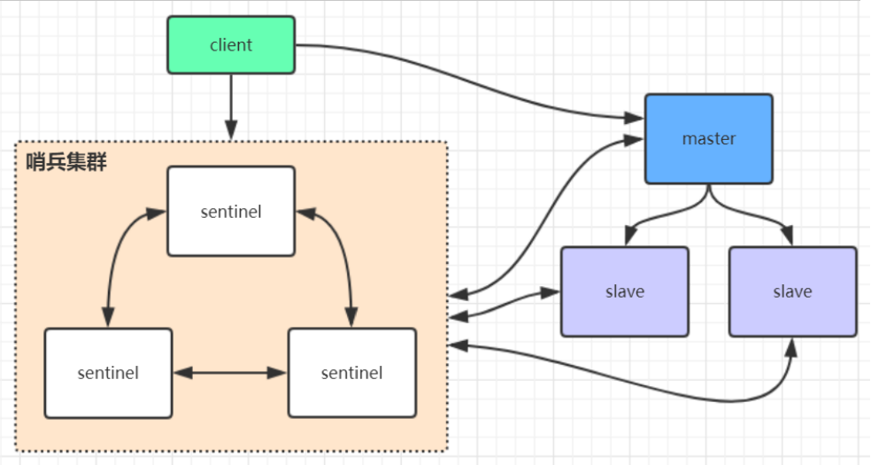
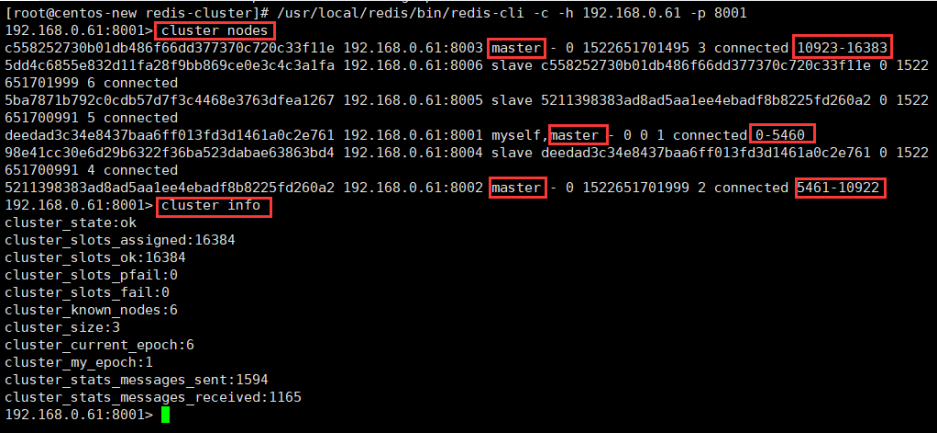

# Redis

## 1. Redis持久化

redis持久化有两种方式，`RDB`和`AOF`

### 1.1 RDB（Redis DataBase）

> RDB持久化将Redis数据以快照的方式写到二进制文件中，默认的文件名为`dump.rdb`，有手动触发和自动触发两种方式。

#### 1.1.1 手动触发分为两种,save和bgsave

- save

  阻塞当前Redis服务器，直到RDB过程完成为止，对于内存 比较大的实例会造成长时间阻塞，线上环境不建议使用

- bgsave

  Redis进程执行fork操作创建子进程，RDB持久化过程由子 进程负责，完成后自动结束。阻塞只发生在fork阶段，一般时间很短

  执行流程：

  

  1. 执行bgsave命令，Redis父进程判断当前是否存在正在执行的子进 程，如RDB/AOF子进程，如果存在bgsave命令直接返回。
  2. 父进程执行fork操作创建子进程，fork操作过程中父进程会阻塞，通 过info stats命令查看latest_fork_usec选项，可以获取最近一个fork操作的耗时，单位为微秒
  3. 父进程fork完成后，bgsave命令返回“Background saving started”信息并不再阻塞父进程，可以继续响应其他命令。
  4. 子进程创建RDB文件，根据父进程内存生成临时快照文件，完成后 对原有文件进行原子替换。执行lastsave命令可以获取最后一次生成RDB的 时间，对应info统计的rdb_last_save_time选项。
  5. 进程发送信号给父进程表示完成，父进程更新统计信息，具体见 info Persistence下的rdb_*相关选项。

#### 1.1.2 自动触发

1. 自动触发是由我们的配置文件来完成的。在redis.conf配置文件中，里面有如下配置，我们可以去设置：

   ①save：这里是用来配置触发 Redis的 RDB 持久化条件，也就是什么时候将内存中的数据保存到硬盘。比如“save m n”。表示m秒内数据集存在n次修改时，自动触发bgsave。

   默认如下配置：

   \#表示900 秒内如果至少有 1 个 key 的值变化，则保存save 900 1#表示300 秒内如果至少有 10 个 key 的值变化，则保存save 300 10#表示60 秒内如果至少有 10000 个 key 的值变化，则保存save 60 10000

   不需要持久化，那么你可以注释掉所有的 save 行来停用保存功能。

   ②stop-writes-on-bgsave-error ：默认值为yes。当启用了RDB且最后一次后台保存数据失败，Redis是否停止接收数据。这会让用户意识到数据没有正确持久化到磁盘上，否则没有人会注意到灾难（disaster）发生了。如果Redis重启了，那么又可以重新开始接收数据了

   ③rdbcompression ；默认值是yes。对于存储到磁盘中的快照，可以设置是否进行压缩存储。

   ④rdbchecksum ：默认值是yes。在存储快照后，我们还可以让redis使用CRC64算法来进行数据校验，但是这样做会增加大约10%的性能消耗，如果希望获取到最大的性能提升，可以关闭此功能。

   ⑤dbfilename ：设置快照的文件名，默认是 dump.rdb

   ⑥dir：设置快照文件的存放路径，这个配置项一定是个目录，而不能是文件名。

   我们可以修改这些配置来实现我们想要的效果。因为第三种方式是配置的，所以我们对前两种进行一个对比：

.jpg)

#### 1.1.3 RDB的优缺点

- 优点
  1. RDB是一个紧凑压缩的二进制文件，代表Redis在某个时间点上的数据 快照。非常适用于备份，全量复制等场景。比如每6小时执行bgsave备份， 并把RDB文件拷贝到远程机器或者文件系统中（如hdfs），用于灾难恢复。
  2. Redis加载RDB恢复数据远远快于AOF的方式。
- 缺点
  1. RDB方式数据没办法做到实时持久化/秒级持久化。因为bgsave每次运 行都要执行fork操作创建子进程，属于重量级操作，频繁执行成本过高。在快照持久化期间修改的数据不会被保存，可能丢失数据
  2. RDB文件使用特定二进制格式保存，Redis版本演进过程中有多个格式 的RDB版本，存在老版本Redis服务无法兼容新版RDB格式的问题。
  3. 针对RDB不适合实时持久化的问题，Redis提供了AOF持久化方式来解决。

### 1.2 AOF（Append Only File）

> redis会将每一个收到的写命令都通过write函数追加到文件中。通俗的理解就是日志记录。以独立日志的方式记录每次写命令， 重启时再重新执行AOF文件中的命令达到恢复数据的目的。AOF的主要作用 是解决了数据持久化的实时性，目前已经是Redis持久化的主流方式。

#### 1.2.1 持久化原理

每当有一个写命令过来时，就直接保存在我们的AOF文件中。

.jpg)

#### 1.2.2 使用AOF

开启AOF功能需要设置配置：appendonly yes，默认不开启。AOF文件名 通过appendfilename配置设置，默认文件名是appendonly.aof。保存路径同 RDB持久化方式一致，通过dir配置指定。AOF的工作流程操作：命令写入 （append）、文件同步（sync）、文件重写（rewrite）、重启加载 （load）

.jpg)

#### 1.2.3 AOF三种触发方式

1. 每修改同步always：同步持久化 每次发生数据变更会被立即记录到磁盘 性能较差但数据完整性比较好

2. 每秒同步everysec：异步操作，每秒记录 如果一秒内宕机，有数据丢失

3. 不同no：从不同步

   .jpg)

#### 1.2.4 aof_buf（缓冲区）

1. AOF为什么把命令追加到aof_buf中？Redis使用单线程响应命令，如 果每次写AOF文件命令都直接追加到硬盘，那么性能完全取决于当前硬盘负 载。先写入缓冲区aof_buf中，还有另一个好处，Redis可以提供多种缓冲区同步硬盘的策略，在性能和安全性方面做出平衡

#### 1.2.5 重写AOF文件

1. AOF的方式也同时带来了另一个问题。持久化文件会变的越来越大。为了压缩aof的持久化文件。redis提供了bgrewriteaof命令。将内存中的数据以命令的方式保存到临时文件中，同时会fork出一条新进程来将文件重写。

   > 重写aof文件的操作，并没有读取旧的aof文件，而是将整个内存中的数据库内容用命令的方式重写了一个新的aof文件，这点和快照有点类似。

   

   .jpg)

2. AOF重写降低了文件占用空间，除此之外，另一个目的是：更小的AOF 文件可以更快地被Redis加载

3. 重写后的AOF文件为什么可以变小？有如下原因：

   - 进程内已经超时的数据不再写入文件。


   - 旧的AOF文件含有无效命令，如del key1、hdel key2、srem keys、set a111、set a222等。重写使用进程内数据直接生成，这样新的AOF文件只保留最终数据的写入命令。


   - 多条写命令可以合并为一个，如：lpush list a、lpush list b、lpush list c可以转化为：lpush list a b c。为了防止单条命令过大造成客户端缓冲区溢 出，对于list、set、hash、zset等类型操作，以64个元素为界拆分为多条。

4. AOF重写过程可以手动触发和自动触发：

   - 手动触发：直接调用bgrewriteaof命令。


   - 自动触发：根据auto-aof-rewrite-min-size和auto-aof-rewrite-percentage参数确定自动触发时机

     - auto-aof-rewrite-min-size：表示运行AOF重写时文件最小体积，默认 为64MB。


     - auto-aof-rewrite-percentage：代表当前AOF文件空间 （aof_current_size）和上一次重写后AOF文件空间（aof_base_size）的比值。


     - 自动触发时机=aof_current_size>auto-aof-rewrite-minsize&&（aof_current_size-aof_base_size）/aof_base_size>=auto-aof-rewritepercentage


     - 其中aof_current_size和aof_base_size可以在info Persistence统计信息中查看。

.jpg)

#### 1.2.6 Redis重启，加载流程

流程说明：

1. AOF持久化开启且存在AOF文件时，优先加载AOF文件，打印如下日志：`DB loaded from append only file: 5.841 seconds`
2. AOF关闭或者AOF文件不存在时，加载RDB文件，打印如下日志：`DB loaded from disk: 5.586 seconds`
3. 加载AOF/RDB文件成功后，Redis启动成功。
4. AOF/RDB文件存在错误时，Redis启动失败并打印错误信息。

.jpg)

#### 1.2.7 AOF的优缺点

1. 优点

   - AOF可以更好的保护数据不丢失，一般AOF会每隔1秒，通过一个后台线程执行一次fsync操作，最多丢失1秒钟的数据。


   - AOF日志文件没有任何磁盘寻址的开销，写入性能非常高，文件不容易破损。


   - AOF日志文件即使过大的时候，出现后台重写操作，也不会影响客户端的读写。


   - AOF日志文件的命令通过非常可读的方式进行记录，这个特性非常适合做灾难性的误删除的紧急恢复。比如某人不小心用flushall命令清空了所有数据，只要这个时候后台rewrite还没有发生，那么就可以立即拷贝AOF文件，将最后一条flushall命令给删了，然后再将该AOF文件放回去，就可以通过恢复机制，自动恢复所有数据

2. 缺点

   - 对于同一份数据来说，AOF日志文件通常比RDB数据快照文件更大


   - AOF开启后，支持的写QPS会比RDB支持的写QPS低，因为AOF一般会配置成每秒fsync一次日志文件，当然，每秒一次fsync，性能也还是很高的


   - 以前AOF发生过bug，就是通过AOF记录的日志，进行数据恢复的时候，没有恢复一模一样的数据出来。

### 1.3 结

1. Redis提供了两种持久化方式：RDB和AOF。
2. RDB使用一次性生成内存快照的方式，产生的文件紧凑压缩比更 高，因此读取RDB恢复速度更快。由于每次 生成RDB开销较大，无法做到实时持久化，一般用于数据冷备和复制传输。
3. save命令会阻塞主线程不建议使用，bgsave命令通过fork操作创建子 进程生成RDB避免阻塞。
4. AOF通过追加写命令到文件实现持久化，通过appendfsync参数可以 控制实时/秒级持久化。因为需要不断追加写命令，所以AOF文件体积逐渐变大，需要定期执行重写操作来降低文件体积。
5. AOF重写可以通过auto-aof-rewrite-min-size和auto-aof-rewritepercentage参数控制自动触发，也可以使用bgrewriteaof命令手动触发。
6. 子进程执行期间使用copy-on-write机制与父进程共享内存，避免内 存消耗翻倍。AOF重写期间还需要维护重写缓冲区，保存新的写入命令避免数据丢失。
7. 持久化阻塞主线程场景有：fork阻塞和AOF追加阻塞。fork阻塞时间 跟内存量和系统有关，AOF追加阻塞说明硬盘资源紧张。
8. 单机下部署多个实例时，为了防止出现多个子进程执行重写操作， 建议做隔离控制，避免CPU和IO资源争。

## 2. Redis的淘汰策略

### 2.1 淘汰策略设置

#### 2.1.1 通过配置文件配置

通过在Redis安装目录下面的redis.conf配置文件中添加以下配置设置内存大小

.png)

#### 2.1.2 通过命令配置

```
//设置Redis最大占用内存大小为100M
127.0.0.1:6379> config set maxmemory 100mb
//获取设置的Redis能使用的最大内存大小
127.0.0.1:6379> config get maxmemory
```

### 2.1 淘汰策略的种类

> 1. volatile-lru：从已设置过期时间的数据集中挑选最近最少使用的数据淘汰。
> 2. volatile-ttl：从已设置过期时间的数据集中挑选将要过期的数据淘汰。
> 3. volatile-random：从已设置过期时间的数据集中任意选择数据淘汰。
> 4. volatile-lfu：从已设置过期时间的数据集挑选使用频率最低的数据淘汰。
> 5. allkeys-lru：从数据集中挑选最近最少使用的数据淘汰
> 6. allkeys-lfu：从数据集中挑选使用频率最低的数据淘汰。
> 7. allkeys-random：从数据集（server.db[i].dict）中任意选择数据淘汰
> 8. no-enviction（驱逐）：禁止驱逐数据，这也是默认策略。意思是当内存不足以容纳新入数据时，新写入操作就会报错，请求可以继续进行，线上任务也不能持续进行，采用no-enviction策略可以保证数据不被丢失。

#### 2.1.1 淘汰策略的区别

> 区分不同的淘汰策略选择不同的key，Redis淘汰策略主要分为LRU淘汰、TTL淘汰、随机淘汰三种机制（LFU淘汰（Redis4.0及以上））。

1. LRU淘汰

   LRU（Least recently used，最近最少使用）算法根据数据的历史访问记录来进行淘汰数据，其核心思想是“如果数据最近被访问过，那么将来被访问的几率也更高”。

   在服务器配置中保存了 lru 计数器 server.lrulock，会定时（redis 定时程序 serverCorn()）更新，server.lrulock 的值是根据 server.unixtime 计算出来进行排序的，然后选择最近使用时间最久的数据进行删除。另外，从 struct redisObject 中可以发现，每一个 redis 对象都会设置相应的 lru。每一次访问数据，会更新对应redisObject.lru

   在Redis中，LRU算法是一个近似算法，默认情况下，Redis会随机挑选5个键，并从中选择一个最久未使用的key进行淘汰。在配置文件中，按maxmemory-samples选项进行配置，选项配置越大，消耗时间就越长，但结构也就越精准。

   Redis3.0对近似LRU算法进行了一些优化。新算法会维护一个候选池（大小为16），池中的数据根据访问时间进行排序，第一次随机选取的key都会放入池中，随后每次随机选取的key只有在访问时间小于池中最小的时间才会放入池中，直到候选池被放满。当放满后，如果有新的key需要放入，则将池中最后访问时间最大（最近被访问）的移除。当需要淘汰的时候，则直接从池中选取最近访问时间最小（最久没被访问）的key淘汰掉就行。

2. TTL淘汰

   Redis 数据集数据结构中保存了键值对过期时间的表，即 redisDb.expires。与 LRU 数据淘汰机制类似，TTL 数据淘汰机制中会先从过期时间的表中随机挑选几个键值对，取出其中 ttl 最大的键值对淘汰。同样，TTL淘汰策略并不是面向所有过期时间的表中最快过期的键值对，而只是随机挑选的几个键值对。

3. 随机淘汰

   在随机淘汰的场景下获取待删除的键值对，随机找hash桶再次hash指定位置的dictEntry即可。

   Redis中的淘汰机制都是几近于算法实现的，主要从性能和可靠性上做平衡，所以并不是完全可靠，所以开发者们在充分了解Redis淘汰策略之后还应在平时多主动设置或更新key的expire时间，主动删除没有价值的数据，提升Redis整体性能和空间。

4. LFU淘汰（Redis4.0及以上）

   根据key的最近被访问的频率进行淘汰，很少被访问的优先被淘汰，被访问的多的则被留下来。LFU算法能更好的表示一个key被访问的热度。假如你使用的是LRU算法，一个key很久没有被访问到，只刚刚是偶尔被访问了一次，那么它就被认为是热点数据，不会被淘汰，而有些key将来是很有可能被访问到的则被淘汰了。如果使用LFU算法则不会出现这种情况，因为使用一次并不会使一个key成为热点数据

#### 2.1.2 如何选择淘汰策略

1. 在Redis中，数据有一部分访问频率较高，其余部分访问频率较低，或者无法预测数据的使用频率时，设置`allkeys-lru`是比较合适的。
2. 如果所有数据访问概率大致相等时，可以选择`allkeys-random`。
3. 如果研发者需要通过设置不同的ttl来判断数据过期的先后顺序，此时可以选择`volatile-ttl`策略。
4. 如果希望一些数据能长期被保存，而一些数据可以被淘汰掉时，选择`volatile-lru`或`volatile-random`都是比较不错的。
5. 由于设置expire会消耗额外的内存，如果计划避免Redis内存在此项上的浪费，可以选用`allkeys-lru` 策略，这样就可以不再设置过期时间，高效利用内存了。

## 3. Redis支持的数据结构

|     数据类型     |                           存储的值                           |                             说明                             |
| :--------------: | :----------------------------------------------------------: | :----------------------------------------------------------: |
|  String(字符串)  |                可以是保存字符串、整数和浮点数                | 可以对字符串进行操作，比如增加字符或者求子串：如果是整数或者浮点数，可以实现计算，比如自增等 |
| Hash(哈希散列表) |     string 类型的 field（字段） 和 value（值） 的映射表      |     可以増、删、査、改单个键值对，也可以获取所有的键值对     |
|    List(列表)    |                          字符串链表                          | Redis 支持从链表的两端插入或者弹出节点，或者通过偏移对它进行裁剪；还可以读取一个或者多个节点，根据条件删除或者查找节点等 |
|    Set(集合)     |              String 类型的无序集合，不允许重复               | 可以新增、读取、删除单个元素：检测一个元素是否在集合中；计算它和其他集合的交集、并集和差集等；随机从集合中读取元素 |
|  Zset(有序集合)  | String 类型的有序集合， 每个元素都会关联一个double类型的分数， 集合的成员是唯一的,但分数(score)却可以重复 | 可以增、删、査、改元素，根据分值的范围或者成员 来获取对应的元素 |

## 4. 缓存穿透，缓存击穿，缓存雪崩

> 前台请求，后台先从缓存中取数据，取到直接返回结果，取不到时从数据库中取，数据库取到更新缓存，并返回结果，数据库也没取到，那直接返回空结果。

.jpg)

### 4.1 缓存穿透

#### 4.1.1 描述

1. 缓存穿透是指**缓存和数据库中都没有的数据**，而用户不断发起请求。由于缓存是不命中时被动写的，并且出于容错考虑，如果从存储层查不到数据则不写入缓存，这将导致这个不存在的数据每次请求都要到存储层去查询，失去了缓存的意义。在流量大时，可能DB就挂掉了，要是有人利用不存在的key频繁攻击我们的应用，这就是漏洞。如发起为id为“-1”的数据或id为特别大不存在的数据。这时的用户很可能是攻击者，攻击会导致数据库压力过大。

#### 4.1.2 解决方案

1. **接口层增加校验。**如用户鉴权校验，id做基础校验，id<=0的直接拦截；

2. **缓存空对象。**

   - 优点：当存储层不命中后，即使返回的空对象也将其缓存起来，同时会设置一个过期时间，之后再访问这个数据将会从缓存中获取，保护了后端数据源；


   - 缺点：如果空值能够被缓存起来，这就意味着缓存需要更多的空间存储更多的键，因为这当中可能会有很多的空值的键；即使对空值设置了过期时间，还是会存在缓存层和存储层的数据会有一段时间窗口的不一致，这对于需要保持一致性的业务会有影响。

3. **布隆过滤器。**

   - 布隆过滤器是由一个很长的bit数组和一系列哈希函数组成的。
   - 数组的每个元素都只占1bit空间，并且每个元素只能为0或1。
   - 布隆过滤器还拥有k个哈希函数，当一个元素加入布隆过滤器时，会使用k个哈希函数对其进行k次计算,得到k个哈希值，并且根据得到的哈希值，在维数组中把对应下标的值置位1。
   - 判断某个数是否在布隆过滤器中，就对该元素进行k次哈希计算，得到的值在位数组中判断每个元素是否都为1，如果每个元素都为1，就说明这个值在布隆过滤器中。

### 4.2 缓存击穿

#### 4.2.1 描述

1. 缓存击穿是指缓存中没有但数据库中有的数据（一般是缓存时间到期），这时由于并发用户特别多，同时读缓存没读到数据，又同时去数据库去取数据，引起数据库压力瞬间增大，造成过大压力。

#### 4.2.2 解决方案

1. **设置热点数据永不过期。**

2. **接口限流与熔断，降级。**重要的接口一定要做好限流策略，防止用户恶意刷接口，同时要降级准备，当接口中的某些 服务  不可用时候，进行熔断，失败快速返回机制。

3. **加互斥锁。**

   .jpg)

   - 说明：

     - 缓存中有数据，直接走上述代码13行后就返回结果了


     - 缓存中没有数据，第1个进入的线程，获取锁并从数据库去取数据，没释放锁之前，其他并行进入的线程会等待100ms，再重新去缓存取数据。这样就防止都去数据库重复取数据，重复往缓存中更新数据情况出现。


     - 当然这是简化处理，理论上如果能根据key值加锁就更好了，就是线程A从数据库取key1的数据并不妨碍线程B取key2的数据，上面代码明显做不到这点。
     - 可以使用redis的`只有在 key 不存在时设置 key 的值`方法实现锁功能。

### 4.3 缓存雪崩

#### 4.3.1 描述

1. 缓存雪崩是指缓存中数据大批量到过期时间，而查询数据量巨大，引起数据库压力过大甚至down机。和缓存击穿不同的是，缓存击穿指并发查同一条数据，缓存雪崩是不同数据都过期了，很多数据都查不到从而查数据库。

#### 4.3.2 解决方案

1. 缓存数据的过期时间设置随机，防止同一时间大量数据过期现象发生。
2. 设置热点数据永远不过期。
3. **redis高可用。**这个思想的含义是，既然redis有可能挂掉，那我多增设几台redis，这样一台挂掉之后其他的还可以继续工作，其实就是搭建的集群。

## 5. Redis主从架构

### 5.1 redis主从架构搭建

**配置从节点步骤：**

1. 复制一份redis.conf文件

2. 将相关配置修改为如下值： 

   ```shell
   port 6380 
   pidfile /var/run/redis_6380.pid # 把pid进程号写入pidfile配置的文件 
   logfile "6380.log"
   dir /usr/local/redis‐5.0.3/data/6380 # 指定数据存放目录 
   # 需要注释掉bind 
   # bind 127.0.0.1（bind绑定的是自己机器网卡的ip，如果有多块网卡可以配多个ip，代表允许客户端通过机器的哪些网卡ip去访问，内网一般可以不配置bind，注释掉即可） 
   ```

3. 配置主从复制 

   ```shell
   replicaof 192.168.0.60 6379 # 从本机6379的redis实例复制数据，Redis 5.0之前使用slaveof 
   replica‐read‐only yes # 配置从节点只读 
   ```

4. 启动从节点 

   ```shell
   redis‐server redis.conf 
   ```

5. 连接从节点 

   ```shell
   redis‐cli ‐p 6380 
   ```

6. 测试在6379实例上写数据，6380实例是否能及时同步新修改数据 

7. 可以自己再配置一个6381的从节点

### 5.2 Redis主从工作原理

> 如果你为master配置了一个slave，不管这个slave是否是第一次连接上Master，它都会发送一个`PSYNC`命令给master请求复制数据。master收到`PSYNC`命令后，会在后台进行数据持久化通过bgsave生成最新的rdb快照文件，持久化期间，master会继续接收客户端的请求，它会把这些可能修改数据集的请求缓存在内存中。当持久化进行完 毕以后，master会把这份rdb文件数据集发送给slave，slave会把接收到的数据进行持久化生成rdb，然后 再加载到内存中。然后，master再将之前缓存在内存中的命令发送给slave。 当master与slave之间的连接由于某些原因而断开时，slave能够自动重连Master，如果master收到了多个slave并发连接请求，它只会进行一次持久化，而不是一个连接一次，然后再把这一份持久化的数据发送给多个并发连接的slave。

**主从复制(全量复制)流程图：**


**数据部分复制：**

> 当master和slave断开重连后，一般都会对整份数据进行复制。但从redis2.8版本开始，redis改用可以支持部分数据复制的命令`PSYNC`去master同步数据，slave与master能够在网络连接断开重连后只进行部分数据复制(**断点续传**)。master会在其内存中创建一个复制数据用的缓存队列，缓存最近一段时间的数据，master和它所有的 slave都维护了复制的数据下标offset和master的进程id，因此，当网络连接断开后，slave会请求master 继续进行未完成的复制，从所记录的数据下标开始。如果master进程id变化了，或者从节点数据下标offset太旧，已经不在master的缓存队列里了，那么将会进行一次全量数据的复制。

**主从复制(部分复制，断点续传)流程图：**


如果有很多从节点，为了缓解**主从复制风暴**(多个从节点同时复制主节点导致主节点压力过大)，可以做如下架构，让部分从节点与从节点(与主节点同步)同步数据


## 6. Redis哨兵高可用架构




> sentinel哨兵是特殊的redis服务，不提供读写服务，主要用来监控redis实例节点。哨兵架构下client端第一次从哨兵找出redis的主节点，后续就直接访问redis的主节点，不会每次都通过sentinel代理访问redis的主节点，当redis的主节点发生变化，哨兵会第一时间感知到，并且将新的redis主节点通知给client端(这里面redis的client端一般都实现了订阅功能，订阅sentinel发布的节点变动消息)

### 6.1 redis哨兵架构搭建

**redis哨兵架构搭建步骤：**

1. 复制一份sentinel.conf文件 

   ```shell
   cp sentinel.conf sentinel‐26379.conf
   ```

2. 将相关配置修改为如下值： 

   ```shell
   port 26379 
   daemonize yes 
   pidfile "/var/run/redis‐sentinel‐26379.pid" 
   logfile "26379.log" 
   dir "/usr/local/redis‐5.0.3/data" 
   # sentinel monitor <master‐redis‐name> <master‐redis‐ip> <master‐redis‐port> <quorum>
   # quorum是一个数字，指明当有多少个sentinel认为一个master失效时(值一般为：sentinel总数/2 + 1)，master才算真正失效 
   sentinel monitor mymaster 192.168.0.60 6379 2 # mymaster这个名字随便取，客户端访问时会用到
   ```

3. 启动sentinel哨兵实例

   ```shell
   src/redis‐sentinel sentinel‐26379.conf
   ```

4. 查看sentinel的info信息

   ```shell
   src/redis‐cli ‐p 26379 
   127.0.0.1:26379>info 
   #可以看到Sentinel的info里已经识别出了redis的主从
   ```

5. 可以自己再配置两个sentinel，端口26380和26381，注意上述配置文件里的对应数字都要修改

**sentinel集群都启动完毕后，会将哨兵集群的元数据信息写入所有sentinel的配置文件里去(追加在文件的最下面)，我们查看下如下配置文件sentinel-26379.conf，如下所示：**

```shell
sentinel known‐replica mymaster 192.168.0.60 6380 #代表redis主节点的从节点信息 
sentinel known‐replica mymaster 192.168.0.60 6381 #代表redis主节点的从节点信息 
sentinel known‐sentinel mymaster 192.168.0.60 26380 52d0a5d70c1f90475b4fc03b6ce7c3c569 35760f #代表感知到的其它哨兵节点 
sentinel known‐sentinel mymaster 192.168.0.60 26381 e9f530d3882f8043f76ebb8e1686438ba8 bd5ca6 #代表感知到的其它哨兵节点
```

**当redis主节点如果挂了，哨兵集群会重新选举出新的redis主节点，同时会修改所有sentinel节点配置文件的集群元数据信息，比如6379的redis如果挂了，假设选举出的新主节点是6380，则sentinel文件里的集群元数据信息会变成如下所示：** 

```shell
sentinel known‐replica mymaster 192.168.0.60 6379 #代表主节点的从节点信息 
sentinel known‐replica mymaster 192.168.0.60 6381 #代表主节点的从节点信息 
sentinel known‐sentinel mymaster 192.168.0.60 26380 52d0a5d70c1f90475b4fc03b6ce7c3c569 35760f #代表感知到的其它哨兵节点 
sentinel known‐sentinel mymaster 192.168.0.60 26381 e9f530d3882f8043f76ebb8e1686438ba8 bd5ca6 #代表感知到的其它哨兵节点
```

**同时还会修改sentinel文件里之前配置的mymaster对应的6379端口，改为6380** 

```shell
sentinel monitor mymaster 192.168.0.60 6380 2
```

**当6379的redis实例再次启动时，哨兵集群根据集群元数据信息就可以将6379端口的redis节点作为从节点加入集群**

## 7. Redis高可用集群

### 7.1 Redis集群方案比较

**哨兵模式** 

> 在redis3.0以前的版本要实现集群一般是借助哨兵sentinel工具来监控master节点的状态，如果master节点异常，则会做主从切换，将某一台slave作为master，哨兵的配置略微复杂，并且性能和高可用性等各方面表现 一般，特别是在主从切换的瞬间存在访问瞬断的情况，而且哨兵模式只有一个主节点对外提供服务，没法支持很高的并发，且单个主节点内存也不宜设置得过大，否则会导致持久化文件过大，影响数据恢复或主从同步的效率 


**高可用集群模式**

> redis集群是一个由多个主从节点群组成的分布式服务器群，它具有复制、高可用和分片特性。Redis集群不需要sentinel哨兵∙也能完成节点移除和故障转移的功能。需要将每个节点设置成集群模式，这种集群模式没有中 心节点，可水平扩展，据官方文档称可以线性扩展到上万个节点(**官方推荐不超过1000个节点**)。redis集群的性能和高可用性均优于之前版本的哨兵模式，且集群配置非常简单


### 7.2 Redis高可用集群搭建

> redis集群需要至少三个master节点，我们这里搭建三个master节点，并且给每个master再搭建一个slave节点，总共6个redis节点，这里用三台机器部署6个redis实例，每台机器一主一从，搭建集群的步骤如下：

```
1 第一步：在第一台机器的/usr/local下创建文件夹redis‐cluster，然后在其下面分别创建2个文件夾如下 
2 （1）mkdir ‐p /usr/local/redis‐cluster 
3 （2）mkdir 8001 8004 
4
5 第一步：把之前的redis.conf配置文件copy到8001下，修改如下内容： 
6 （1）daemonize yes 
7 （2）port 8001（分别对每个机器的端口号进行设置） 
8 （3）pidfile /var/run/redis_8001.pid # 把pid进程号写入pidfile配置的文件 
9 （4）dir /usr/local/redis‐cluster/8001/（指定数据文件存放位置，必须要指定不同的目录位置，不然会 丢失数据） 
10 （5）cluster‐enabled yes（启动集群模式） 
11 （6）cluster‐config‐file nodes‐8001.conf（集群节点信息文件，这里800x最好和port对应上） 
12 （7）cluster‐node‐timeout 10000 
13 (8)# bind 127.0.0.1（bind绑定的是自己机器网卡的ip，如果有多块网卡可以配多个ip，代表允许客户端通 过机器的哪些网卡ip去访问，内网一般可以不配置bind，注释掉即可） 
14 (9)protected‐mode no （关闭保护模式） 
15 (10)appendonly yes 
16 如果要设置密码需要增加如下配置： 
17 (11)requirepass zhuge (设置redis访问密码) 
18 (12)masterauth zhuge (设置集群节点间访问密码，跟上面一致) 
19
20 第三步：把修改后的配置文件，copy到8004，修改第2、3、4、6项里的端口号，可以用批量替换： 
21 :%s/源字符串/目的字符串/g 
22
23 第四步：另外两台机器也需要做上面几步操作，第二台机器用8002和8005，第三台机器用8003和8006 
24
25 第五步：分别启动6个redis实例，然后检查是否启动成功 
26 （1）/usr/local/redis‐5.0.3/src/redis‐server /usr/local/redis‐cluster/800*/redis.conf 
27 （2）ps ‐ef | grep redis 查看是否启动成功 28
29 第六步：用redis‐cli创建整个redis集群(redis5以前的版本集群是依靠ruby脚本redis‐trib.rb实现) 
30 # 下面命令里的1代表为每个创建的主服务器节点创建一个从服务器节点 
31 # 执行这条命令需要确认三台机器之间的redis实例要能相互访问，可以先简单把所有机器防火墙关掉，如果不 关闭防火墙则需要打开redis服务端口和集群节点gossip通信端口16379(默认是在redis端口号上加1W) 
32 # 关闭防火墙 
33 # systemctl stop firewalld # 临时关闭防火墙 
34 # systemctl disable firewalld # 禁止开机启动 
35 # 注意：下面这条创建集群的命令大家不要直接复制，里面的空格编码可能有问题导致创建集群不成功 
36 （1）/usr/local/redis‐5.0.3/src/redis‐cli ‐a zhuge ‐‐cluster create ‐‐cluster‐replicas 1 1 92.168.0.61:8001 192.168.0.62:8002 192.168.0.63:8003 192.168.0.61:8004 192.168.0.62:8005 192. 168.0.63:8006 
37
38 第七步：验证集群：
39 （1）连接任意一个客户端即可：./redis‐cli ‐c ‐h ‐p (‐a访问服务端密码，‐c表示集群模式，指定ip地址 和端口号） 
40 如：/usr/local/redis‐5.0.3/src/redis‐cli ‐a zhuge ‐c ‐h 192.168.0.61 ‐p 800* 
41 （2）进行验证： cluster info（查看集群信息）、cluster nodes（查看节点列表） 
42 （3）进行数据操作验证 
43 （4）关闭集群则需要逐个进行关闭，使用命令： 
44 /usr/local/redis‐5.0.3/src/redis‐cli ‐a zhuge ‐c ‐h 192.168.0.60 ‐p 800* shutdown
```

### 7.3 Redis集群原理分析

> Redis Cluster 将所有数据划分为 16384 个 slots(槽位)，每个节点负责其中一部分槽位。槽位的信息存储于每个节点中。 当 Redis Cluster 的客户端来连接集群时，它也会得到一份集群的槽位配置信息并将其缓存在客户端本地。这 样当客户端要查找某个 key 时，可以直接定位到目标节点。同时因为槽位的信息可能会存在客户端与服务器不一致的情况，还需要纠正机制来实现槽位信息的校验调整。

**槽位定位算法**

> Cluster 默认会对 key 值使用 crc16 算法进行 hash 得到一个整数值，然后用这个整数值对 16384 进行取模来得到具体槽位。 
>
> HASH_SLOT = CRC16(key) mod 16384

**跳转重定位**

> 当客户端向一个错误的节点发出了指令，该节点会发现指令的 key 所在的槽位并不归自己管理，这时它会向客户端发送一个特殊的跳转指令携带目标操作的节点地址，告诉客户端去连这个节点去获取数据。客户端收到指 令后除了跳转到正确的节点上去操作，还会同步更新纠正本地的槽位映射表缓存，后续所有 key 将使用新的槽位映射表。 


**Redis集群节点间的通信机制**

> redis cluster节点间采取gossip协议进行通信
>
> - 维护集群的元数据(集群节点信息，主从角色，节点数量，各节点共享的数据等)有两种方式：集中式和gossip

1. **集中式：**

   > 优点在于元数据的更新和读取，时效性非常好，一旦元数据出现变更立即就会更新到集中式的存储中，其他节点读取的时候立即就可以立即感知到；不足在于所有的元数据的更新压力全部集中在一个地方，可能导致元数据的存储压力。 很多中间件都会借助zookeeper集中式存储元数据。

2. **gossip：**

   

   **gossip协议包含多种消息，包括ping，pong，meet，fail等等。** 

   - meet：某个节点发送meet给新加入的节点，让新节点加入集群中，然后新节点就会开始与其他节点进行通 信；

   - ping：每个节点都会频繁给其他节点发送ping，其中包含自己的状态还有自己维护的集群元数据，互相通过ping交换元数据(类似自己感知到的集群节点增加和移除，hash slot信息等)； 

   - pong: 对ping和meet消息的返回，包含自己的状态和其他信息，也可以用于信息广播和更新； 

   - fail: 某个节点判断另一个节点fail之后，就发送fail给其他节点，通知其他节点，指定的节点宕机了。 

   > gossip协议的优点在于元数据的更新比较分散，不是集中在一个地方，更新请求会陆陆续续，打到所有节点上去更新，有一定的延时，降低了压力；缺点在于元数据更新有延时可能导致集群的一些操作会有一些滞后。 

   **gossip通信的10000端口** 

   > 每个节点都有一个专门用于节点间gossip通信的端口，就是自己提供服务的端口号+10000，比如7001，那么 用于节点间通信的就是17001端口。 每个节点每隔一段时间都会往另外几个节点发送ping消息，同时其他几点接收到ping消息之后返回pong消息。 

**网络抖动**

> 真实世界的机房网络往往并不是风平浪静的，它们经常会发生各种各样的小问题。比如网络抖动就是非常常见的一种现象，突然之间部分连接变得不可访问，然后很快又恢复正常。为解决这种问题，Redis Cluster 提供了一种选项cluster­node­timeout，表示当某个节点持续 timeout的时间失联时，才可以认定该节点出现故障，需要进行主从切换。如果没有这个选项，网络抖动会导致主从频繁切换 (数据的重新复制)。

**Redis集群选举原理分析** 

> 当slave发现自己的master变为FAIL状态时，便尝试进行Failover，以期成为新的master。由于挂掉的master 可能会有多个slave，从而存在多个slave竞争成为master节点的过程， 其过程如下：

1. slave发现自己的master变为FAIL 

2. 将自己记录的集群currentEpoch加1，并广播FAILOVER_AUTH_REQUEST 信息
3. 其他节点收到该信息，只有master响应，判断请求者的合法性，并发送FAILOVER_AUTH_ACK，对每一个epoch只发送一次ack 

4. 尝试failover的slave收集master返回的FAILOVER_AUTH_ACK 

5. slave收到超过半数master的ack后变成新Master(这里解释了集群为什么至少需要三个主节点，如果只有两 个，当其中一个挂了，只剩一个主节点是不能选举成功的) 

6. slave广播Pong消息通知其他集群节点。 

> 从节点并不是在主节点一进入 FAIL 状态就马上尝试发起选举，而是有一定延迟，一定的延迟确保我们等待FAIL状态在集群中传播，slave如果立即尝试选举，其它masters或许尚未意识到FAIL状态，可能会拒绝投票

- 延迟计算公式： 

  ```
  DELAY = 500ms + random(0 ~ 500ms) + SLAVE_RANK * 1000ms 
  ```

- SLAVE_RANK表示此slave已经从master复制数据的总量的rank。Rank越小代表已复制的数据越新。这种方式下，持有最新数据的slave将会首先发起选举（理论上）。 

**集群脑裂数据丢失问题**

> redis集群没有过半机制会有脑裂问题，网络分区导致脑裂后多个主节点对外提供写服务，一旦网络分区恢复，会将其中一个主节点变为从节点，这时会有大量数据丢失。规避方法可以在redis配置里加上参数(这种方法不可能百分百避免数据丢失，参考集群leader选举机制)：
>
> ```shell
> min‐replicas‐to‐write 1 //写数据成功最少同步的slave数量，这个数量可以模仿大于半数机制配置，比如 集群总共三个节点可以配置1，加上leader就是2，超过了半数
> ```
>
> **注意**：这个配置在一定程度上会影响集群的可用性，比如slave要是少于1个，这个集群就算leader正常也不能提供服务了，需要具体场景权衡选择。

**集群是否完整才能对外提供服务** 

> 当redis.conf的配置cluster-require-full-coverage为no时，表示当负责一个插槽的主库下线且没有相应的从库进行故障恢复时，集群仍然可用，如果为yes则集群不可用。 

**Redis集群为什么至少需要三个master节点，并且推荐节点数为奇数？** 

> 因为新master的选举需要大于半数的集群master节点同意才能选举成功，如果只有两个master节点，当其中一个挂了，是达不到选举新master的条件的。奇数个master节点可以在满足选举该条件的基础上节省一个节点，比如三个master节点和四个master节点的集群相比，大家如果都挂了一个master节点都能选举新master节点，如果都挂了两个master节点都没法选举新master节点了，所以奇数的master节点更多的是**从节省机器资源角度出发**说的。 

**Redis集群对批量操作命令的支持** 

> 对于类似mset，mget这样的多个key的原生批量操作命令，redis集群只支持所有key落在同一slot的情况，如果有多个key一定要用mset命令在redis集群上操作，则可以在key的前面加上{XX}，这样参数数据分片hash计算的只会是大括号里的值，这样能确保不同的key能落到同一slot里去，示例如下： 
>
> ```shell
> mset {user1}:1:name zhuge {user1}:1:age 18
> ```
>
> 假设name和age计算的hash slot值不一样，但是这条命令在集群下执行，redis只会用大括号里的 user1 做hash slot计算，所以算出来的slot值肯定相同，最后都能落在同一slot。

**哨兵leader选举流程** 

当一个master服务器被某sentinel视为下线状态后，该sentinel会与其他sentinel协商选出sentinel的leader进行故障转移工作。每个发现master服务器进入下线的sentinel都可以要求其他sentinel选自己为sentinel的leader，选举是先到先得。同时每个sentinel每次选举都会自增配置纪元(选举周期)，每个纪元中只会选择一个sentinel的leader。如果所有超过一半的sentinel选举某sentinel作为leader。之后该sentinel进行故障转移操作，从存活的slave中选举出新的master，这个选举过程跟集群的master选举很类似。 哨兵集群只有一个哨兵节点，redis的主从也能正常运行以及选举master，如果master挂了，那唯一的那个哨兵节点就是哨兵leader了，可以正常选举新master。 不过为了高可用一般都推荐至少部署三个哨兵节点。为什么推荐奇数个哨兵节点原理跟集群奇数个master节点类似。

### 7.4 Redis高可用集群水平扩展

> Redis3.0以后的版本虽然有了集群功能，提供了比之前版本的哨兵模式更高的性能与可用性，但是集群的水平扩展却比较麻烦，今天就来带大家看看redis高可用集群如何做水平扩展，**原始集群(见下图)由6个节点组成，6个节点分布在三台机器上，采用三主三从的模式**


#### 7.4.1 启动集群

**启动整个集群**

```shell
/usr/local/redis‐5.0.3/src/redis‐server /usr/local/redis‐cluster/8001/redis.conf 
/usr/local/redis‐5.0.3/src/redis‐server /usr/local/redis‐cluster/8002/redis.conf 
/usr/local/redis‐5.0.3/src/redis‐server /usr/local/redis‐cluster/8003/redis.conf 
/usr/local/redis‐5.0.3/src/redis‐server /usr/local/redis‐cluster/8004/redis.conf 
/usr/local/redis‐5.0.3/src/redis‐server /usr/local/redis‐cluster/8005/redis.conf 
/usr/local/redis‐5.0.3/src/redis‐server /usr/local/redis‐cluster/8006/redis.conf
```

**客户端连接8001端口的redis实例**

```shell
/usr/local/redis‐5.0.3/src/redis‐cli ‐a zhuge ‐c ‐h 192.168.0.61 ‐p 8001
```

**查看集群状态**

```shell
192.168.0.61:8001> cluster nodes
```



*从上图可以看出，整个集群运行正常，三个master节点和三个slave节点，8001端口的实例节点存储0-5460这些hash槽，8002端口的实例节点存储5461-10922这些hash槽，8003端口的实例节点存储10923-16383这些hash槽，这三个master节点存储的所有hash槽组成redis集群的存储槽位，slave点是每个主节点的备份从节点，不显示存储槽位*

#### 7.4.2 集群操作

我们在原始集群基础上再增加一主(8007)一从(8008)，增加节点后的集群参见下图，新增节点用虚线框表示


**增加redis实例**

> 在/usr/local/redis-cluster下创建8007和8008文件夹，并拷贝8001文件夹下的redis.conf文件到8007和8008这两个文件夹下 

```shell
1 mkdir 8007 8008 
2 cd 8001 
3 cp redis.conf /usr/local/redis‐cluster/8007/ 
4 cp redis.conf /usr/local/redis‐cluster/8008/ 
5
6 # 修改8007文件夹下的redis.conf配置文件 
7 vim /usr/local/redis‐cluster/8007/redis.conf 
8 # 修改如下内容： 
9 port:8007 
10 dir /usr/local/redis‐cluster/8007/ 
11 cluster‐config‐file nodes‐8007.conf 
12
13 # 修改8008文件夹下的redis.conf配置文件 
14 vim /usr/local/redis‐cluster/8008/redis.conf 
15 修改内容如下： 
16 port:8008 
17 dir /usr/local/redis‐cluster/8008/ 
18 cluster‐config‐file nodes‐8008.conf 
19
20 # 启动8007和8008俩个服务并查看服务状态 
21 /usr/local/redis‐5.0.3/src/redis‐server /usr/local/redis‐cluster/8007/redis.conf 
22 /usr/local/redis‐5.0.3/src/redis‐server /usr/local/redis‐cluster/8008/redis.conf 
23 ps ‐el | grep redis
```

**查看redis集群的命令帮助**

```shell
1 cd /usr/local/redis‐5.0.3 
2 src/redis‐cli ‐‐cluster help
```


1. create：创建一个集群环境host1:port1 ... hostN:portN 

2. call：可以执行redis命令 

3. add-node：将一个节点添加到集群里，第一个参数为新节点的ip:port，第二个参数为集群中任意一个已经存在的节点的ip:port 

4. del-node：移除一个节点 

5. reshard：重新分片 

6. check：检查集群状态 

**配置8007为集群主节点**

> 使用add-node命令新增一个主节点8007(master)，前面的ip:port为新增节点，后面的ip:port为已知存在节点，看到日志最后有"[OK]New node added correctly"提示代表新节点加入成功

```shell
/usr/local/redis‐5.0.3/src/redis‐cli ‐a zhuge ‐‐cluster add‐node 192.168.0.61:8007 192.168.0.61:8001
```

>  查看集群状态

```shell
/usr/local/redis‐5.0.3/src/redis‐cli ‐a zhuge ‐c ‐h 192.168.0.61 ‐p 8001 
192.168.0.61:8001> cluster nodes
```


***注意：当添加节点成功以后，新增的节点不会有任何数据，因为它还没有分配任何的slot(hash槽)，我们需要为新节点手工分配hash槽*** 

> 使用redis-cli命令为8007分配hash槽，找到集群中的任意一个主节点，对其进行重新分片工作。

```shell
/usr/local/redis‐5.0.3/src/redis‐cli ‐a zhuge ‐‐cluster reshard 192.168.0.61:8001
```

*输出如下：*

```shell
... ... 
How many slots do you want to move (from 1 to 16384)? 600 
(ps:需要多少个槽移动到新的节点上，自己设置，比如600个hash槽) 
What is the receiving node ID? 2728a594a0498e98e4b83a537e19f9a0a3790f38 
(ps:把这600个hash槽移动到哪个节点上去，需要指定节点id) 
Please enter all the source node IDs. 
Type 'all' to use all the nodes as source nodes for the hash slots. 
Type 'done' once you entered all the source nodes IDs. 
Source node 1:all
(ps:输入all为从所有主节点(8001,8002,8003)中分别抽取相应的槽数指定到新节点中，抽取的总槽数为600个) 
... ... 
Do you want to proceed with the proposed reshard plan (yes/no)? yes 
(ps:输入yes确认开始执行分片任务) 
... ...
```

> 查看下最新的集群状态

```shell
/usr/local/redis‐5.0.3/src/redis‐cli ‐a zhuge ‐c ‐h 192.168.0.61 ‐p 8001 
192.168.0.61:8001> cluster nodes
```


*如上图所示，现在我们的8007已经有hash槽了，也就是说可以在8007上进行读写数据啦！到此为止我们的8007已经加入到集群中，并且是主节点(Master)*

**配置8008为8007的从节点**

> 添加从节点8008到集群中去并查看集群状态 

```shell
/usr/local/redis‐5.0.3/src/redis‐cli ‐a zhuge ‐‐cluster add‐node 192.168.0.61:8008 192.168.0.61:8001
```


*如图所示，还是一个master节点，没有被分配任何的hash槽。*

> 我们需要执行replicate命令来指定当前节点(从节点)的主节点id为哪个,首先需要连接新加的8008节点的客户端，然后使用集群命令进行操作，把当前的8008(slave)节点指定到一个主节点下(这里使用之前创建的8007主节点)

```shell
/usr/local/redis‐5.0.3/src/redis‐cli ‐a zhuge ‐c ‐h 192.168.0.61 ‐p 8008 
192.168.0.61:8008> cluster replicate 2728a594a0498e98e4b83a537e19f9a0a3790f38 #后面这串id为8007的节点id
```

> 查看集群状态，8008节点已成功添加为8007节点的从节点


**删除8008从节点** 

> 用del-node删除从节点8008，指定删除节点ip和端口，以及节点id(红色为8008节点id) 

```shell
/usr/local/redis‐5.0.3/src/redis‐cli ‐a zhuge ‐‐cluster del‐node 192.168.0.61:8008 a1cfe35722d151cf70585cee212755653 93c0956
```

> 再次查看集群状态，如下图所示，8008这个slave节点已经移除，并且该节点的redis服务也已被停止


**删除8007主节点** 

> 最后，我们尝试删除之前加入的主节点8007，这个步骤相对比较麻烦一些，因为主节点的里面是有分配了hash槽的，所以我们这里必须先把8007里的hash槽放入到其他的可用主节点中去，然后再进行移除节点操作，不然会出现数据丢失问题(目前只能把master的数据迁移到一个节点上，暂时做不了平均分配功能)，执行命令如下：

```shell
/usr/local/redis‐5.0.3/src/redis‐cli ‐a zhuge ‐‐cluster reshard 192.168.0.61:8007
```

*输出如下：* 

```shell
... ... 
How many slots do you want to move (from 1 to 16384)? 600 
What is the receiving node ID? dfca1388f124dec92f394a7cc85cf98cfa02f86f 
(ps:这里是需要把数据移动到哪？8001的主节点id) 
Please enter all the source node IDs. 
Type 'all' to use all the nodes as source nodes for the hash slots. 
Type 'done' once you entered all the source nodes IDs. 
Source node 1:2728a594a0498e98e4b83a537e19f9a0a3790f38 
(ps:这里是需要数据源，也就是我们的8007节点id) 
Source node 2:done 
(ps:这里直接输入done 开始生成迁移计划) 
... ... 
Do you want to proceed with the proposed reshard plan (yes/no)? Yes 
(ps:这里输入yes开始迁移) 
```

*至此，我们已经成功的把8007主节点的数据迁移到8001上去了，我们可以看一下现在的集群状态如下图，你会发现8007下面已经没有任何hash槽了，证明迁移成功！*


> 最后我们直接使用del-node命令删除8007主节点即可

```shell
/usr/local/redis‐5.0.3/src/redis‐cli ‐a zhuge ‐‐cluster del‐node 192.168.0.61:8007 2728a594a0498e98e4b83a537e19f9a0a 3790f38
```

> 查看集群状态，一切还原为最初始状态啦！大功告成！ 


