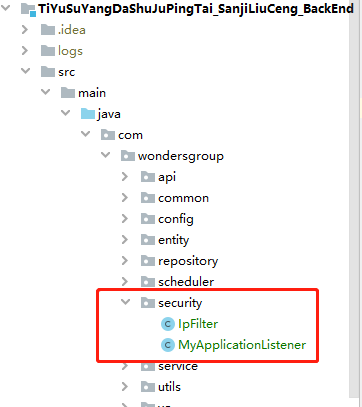
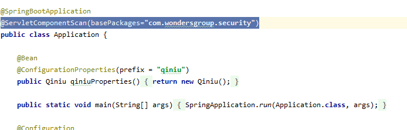

# 日常

## 1. maven

### 1.1 打包：

#### 1.1.1 打war包跳过测试 : 

​	clean package -Dmaven.test.skip=true 

#### 1.1.2 打jar包跳过测试 : 

​	clean install -Dmaven.test.skip=true    


## 2. spring boot

### 2.1 spring boot项目部署tomcat解决：

#### 2.1.1 修改POM文件，添加 <packaging>war</packaging>

```java
<groupId>ymx.example</groupId>
<artifactId>myitem</artifactId>
<version>0.0.1-SNAPSHOT</version>
<packaging>war</packaging>
<name>myitem</name>
```

#### 2.1.2 排除内置的tomcat容器，添加依赖：

```java
<dependency>
    <groupId>org.springframework.boot</groupId>
    <artifactId>spring-boot-starter-tomcat</artifactId>
    <!--打包的时候可以不用包进去，别的设施会提供。事实上该依赖理论上可以参与编译，测试，运行等周期。
        相当于compile，但是打包阶段做了exclude操作-->
    <scope>provided</scope>
</dependency>
```

#### 2.1.3 继承org.springframework.boot.web.servlet.support.SpringBootServletInitializer，实现configure方法：

```java
@SpringBootApplication
public class MyitemApplication extends SpringBootServletInitializer {

    protected SpringApplicationBuilder configure(SpringApplicationBuilder builder) {
        return builder.sources(MyitemApplication.class);
    }

    public static void main(String[] args) {
        SpringApplication.run(MyitemApplication.class, args);
    }

}
```

#### 2.1.4 注意事项

使用外部Tomcat部署访问的时候，application.properties(或者application.yml)中配置的

```yaml
server:
  port: 8080 #端口号
  servlet:
    context-path: myitem #项目访问根路径
```

将失效，请使用tomcat的端口，tomcat，webapps下项目名进行访问。

为了防止应用上下文所导致的项目访问资源加载不到的问题，

建议pom.xml文件中<build></build>标签下添加<finalName></finalName>标签：

```java
<build>
   <finalName>itemstaffmanage</finalName>
   <plugins>
      <plugin>
         <groupId>org.springframework.boot</groupId>
         <artifactId>spring-boot-maven-plugin</artifactId>
      </plugin>
   </plugins>
</build>
```

### 2.2 禁止内置Tomcat不安全的HTTP方法

2.*版本

```java
@Configuration
public class TomcatConfig {
	@Bean
    public TomcatServletWebServerFactory servletContainer() {
        TomcatServletWebServerFactory tomcatServletContainerFactory = new TomcatServletWebServerFactory() {
            @Override
            protected void postProcessContext(Context context) {
                SecurityConstraint constraint = new SecurityConstraint();
                constraint.setUserConstraint("CONFIDENTIAL");
                SecurityCollection collection = new SecurityCollection();
                //url匹配表达式
                collection.addPattern("/*");
                //禁用内置Tomcat的不安全请求方法
	            collection.addMethod("HEAD");
	            collection.addMethod("PUT");
	            collection.addMethod("PATCH");
	            collection.addMethod("DELETE");
	            collection.addMethod("OPTIONS");
	            collection.addMethod("TRACE");
	            collection.addMethod("COPY");
	            collection.addMethod("SEARCH");
	            collection.addMethod("PROPFIND");
	            constraint.addCollection(collection);
	            constraint.setAuthConstraint(true);
	            context.addConstraint(constraint);
                //设置使用httpOnly
	            context.setUseHttpOnly(true);
                constraint.addCollection(collection);
                context.addConstraint(constraint);
            }
        };
        //如果需要禁用TRACE请求，需添加以下代码：
        tomcatServletContainerFactory.addConnectorCustomizers(connector -> {
            connector.setAllowTrace(true);
        });
        return tomcatServletContainerFactory;
    }
 
}
```

1.5.*版本

```java
@Configuration
	public class TomcatConfig {
		@Bean
		public EmbeddedServletContainerFactory servletContainer() {
			TomcatEmbeddedServletContainerFactory tomcatServletContainerFactory = new TomcatEmbeddedServletContainerFactory();
			tomcatServletContainerFactory.addContextCustomizers(new TomcatContextCustomizer() {

				@Override
				public void customize(Context context) {
					SecurityConstraint constraint = new SecurityConstraint();
					SecurityCollection collection = new SecurityCollection();
					//http方法
					collection.addMethod("PUT");
					collection.addMethod("DELETE");
					collection.addMethod("HEAD");
					collection.addMethod("OPTIONS");
					collection.addMethod("TRACE");
					//url匹配表达式
					collection.addPattern("/*");
					constraint.addCollection(collection);
					constraint.setAuthConstraint(true);
					context.addConstraint(constraint);

					//设置使用httpOnly
					context.setUseHttpOnly(true);

				}
			});
			return tomcatServletContainerFactory;
		}
	}
```

### 2.3 配置全局异常捕捉

2.3.1 工具类

```java
/**
 * 全局404/500异常捕捉处理工具
 */
@ControllerAdvice
public class GlobalExceptionHandler {
    @ExceptionHandler
    @ResponseBody
    public ResponseVO defaultErrorHandler(Exception e) {
        ResponseVO result;
        String message = e.getMessage();
        if (message.equals(ResultCode.UNAUTHORIZED.getCode().toString())) {
            result = new ResponseVO(ResultCode.UNAUTHORIZED.getCode(), ResultCode.UNAUTHORIZED.getMessage());
        } else if (e instanceof NoHandlerFoundException) {
            result = new ResponseVO(ResultCode.NOT_FOUND.getCode(), ResultCode.NOT_FOUND.getMessage());
        } else {
            result = new ResponseVO(ResultCode.INTERNAL_SERVER_ERROR.getCode(), ResultCode.INTERNAL_SERVER_ERROR.getMessage());
        }
        return result;
    }
}
```

2.3.2 异常code类

```java
public enum ResultCode {

    /** 成功 */
    SUCCESS(200, "successed"),
    /** 操作失败 */
    FAIL(209, "failed"),

    /** 成功 */
    OK(200, "OK"),

    /** 用户新建或修改数据成功 */
    CREATED(201, "CREATED"),

    /** 用户删除数据成功 */
    NO_CONTENT(204, "NO CONTENT"),


    /** 用户发出的请求有错误 */
    INVALID_REQUEST(400, "INVALID REQUEST"),

    /** 未经授权 用户需要进行身份验证 */
    UNAUTHORIZED(401, "UNAUTHORIZED"),

    /** 访问是被禁止 */
    FORBIDDEN(403, "FORBIDDEN"),

    /** 不存在的记录 */
    NOT_FOUND(404, "NOT FOUND"),

    /** 当创建一个对象时，发生一个验证错误 */
    UNPROCESABLE_ENTITY(411, "UNPROCESABLE ENTITY"),

    /** 资源被永久删除 */
    GONE(414, "GONE"),


    /** 服务器发生错误 */
    INTERNAL_SERVER_ERROR(500, "INTERNAL SERVER ERROR");

    private Integer code;
    private String message;

    ResultCode(Integer code, String message){
        this.code = code;
        this.message = message != null ? message : "";
    }

    public Integer getCode() {
        return code;
    }

    public String getMessage() {
        return message;
    }
}
```

### 2.4 IP频繁访问限制

2.4.1 过滤器

```java
/**
 * 自定义过滤器，用来判断IP访问次数是否超限
 * 如果前台用户访问网站的频率过快（达到超过50次/秒），则判定该ip恶意刷新操作，
 * 限制该IP的访问，1小时后自己解除限制
 */
@WebFilter(urlPatterns = "/*")
public class IpFilter implements Filter {

    private final static Logger logger = LoggerFactory.getLogger(IpFilter.class);
    
    /**
     * 默认限制时间（单位：ms）
     */
    private static final long LIMITED_TIME_MILLIS = 60 * 60 * 1000;

    /**
     * 用户连续访问最高阀值，超过该值则认定为恶意操作的IP，进行限制
     */
    private static final int LIMIT_NUMBER = 50;

    /**
     * 用户访问最小安全时间，在该时间内如果访问次数大于阀值，则记录为恶意IP，否则视为正常访问
     */
    private static final int MIN_SAFE_TIME = 5000;
    private FilterConfig config;

    @Override
    public void init(FilterConfig filterConfig) throws ServletException {
        this.config = filterConfig;    //设置属性filterConfig
    }

    /* (non-Javadoc)
     * @see javax.servlet.Filter#doFilter(javax.servlet.ServletRequest, javax.servlet.ServletResponse, javax.servlet.FilterChain)
     */
    @SuppressWarnings("unchecked")
    @Override
    public void doFilter(ServletRequest servletRequest, ServletResponse servletResponse, FilterChain chain)
            throws IOException, ServletException {
        HttpServletRequest request = (HttpServletRequest) servletRequest;
        HttpServletResponse response = (HttpServletResponse) servletResponse;
        ServletContext context = config.getServletContext();
        // 获取限制IP存储器：存储被限制的IP信息
        Map<String, Long> limitedIpMap = (Map<String, Long>) context.getAttribute("limitedIpMap");
        // 过滤受限的IP
        filterLimitedIpMap(limitedIpMap);
        // 获取用户IP
        String ip = request.getRemoteHost();
        logger.info("ip:" + ip);
        // 判断是否是被限制的IP，如果是则跳到异常页面
        if (isLimitedIP(limitedIpMap, ip)) {
            long limitedTime = limitedIpMap.get(ip) - System.currentTimeMillis();
            // 剩余限制时间(用为从毫秒到秒转化的一定会存在些许误差，但基本可以忽略不计)
            request.setAttribute("remainingTime", ((limitedTime / 1000) + (limitedTime % 1000 > 0 ? 1 : 0)));
            //request.getRequestDispatcher("/error/overLimitIP").forward(request, response);
            logger.error("ip访问过于频繁：" + ip);
            //response.setCharacterEncoding("gb2312");    //设置输出内容编码格式
//            response.reset();
//            response.setCharacterEncoding("utf-8");    //设置输出内容编码格式
//            PrintWriter out = response.getWriter();
//            out.println("<b>由于您访问过于频繁，被系统自动认定为机器人。1个小时自动解除</b>");、
            return;
        }
        // 获取IP存储器
        Map<String, Long[]> ipMap = (Map<String, Long[]>) context.getAttribute("ipMap");
        // 判断存储器中是否存在当前IP，如果没有则为初次访问，初始化该ip
        // 如果存在当前ip，则验证当前ip的访问次数
        // 如果大于限制阀值，判断达到阀值的时间，如果不大于[用户访问最小安全时间]则视为恶意访问，跳转到异常页面
        if (ipMap.containsKey(ip)) {
            Long[] ipInfo = ipMap.get(ip);
            ipInfo[0] = ipInfo[0] + 1;
            logger.info("当前第[" + (ipInfo[0]) + "]次访问");
            if (ipInfo[0] > LIMIT_NUMBER) {
                Long ipAccessTime = ipInfo[1];
                Long currentTimeMillis = System.currentTimeMillis();
                if (currentTimeMillis - ipAccessTime <= MIN_SAFE_TIME) {
                    limitedIpMap.put(ip, currentTimeMillis + LIMITED_TIME_MILLIS);
                    request.setAttribute("remainingTime", LIMITED_TIME_MILLIS);
                    logger.error("ip访问过于频繁：" + ip);
                    request.getRequestDispatcher("/error/overLimitIP").forward(request, response);
                    return;
                } else {
                    initIpVisitsNumber(ipMap, ip);
                }
            }
        } else {
            initIpVisitsNumber(ipMap, ip);
            logger.info("您首次访问该网站");
        }
        context.setAttribute("ipMap", ipMap);
        chain.doFilter(request, response);
    }

    @Override
    public void destroy() {
        // TODO Auto-generated method stub
    }

    /**
     * @param limitedIpMap
     * @Description 过滤受限的IP，剔除已经到期的限制IP
     */
    private void filterLimitedIpMap(Map<String, Long> limitedIpMap) {
        if (limitedIpMap == null) {
            return;
        }
        Set<String> keys = limitedIpMap.keySet();
        Iterator<String> keyIt = keys.iterator();
        long currentTimeMillis = System.currentTimeMillis();
        while (keyIt.hasNext()) {
            long expireTimeMillis = limitedIpMap.get(keyIt.next());
            if (expireTimeMillis <= currentTimeMillis) {
                keyIt.remove();
            }
        }
    }

    /**
     * @param limitedIpMap
     * @param ip
     * @return true : 被限制 | false : 正常
     * @Description 是否是被限制的IP
     */
    private boolean isLimitedIP(Map<String, Long> limitedIpMap, String ip) {
        if (limitedIpMap == null || ip == null) {
            // 没有被限制
            return false;
        }
        Set<String> keys = limitedIpMap.keySet();
        Iterator<String> keyIt = keys.iterator();
        while (keyIt.hasNext()) {
            String key = keyIt.next();
            if (key.equals(ip)) {
                // 被限制的IP
                return true;
            }
        }
        return false;
    }

    /**
     * 初始化用户访问次数和访问时间
     *
     * @param ipMap
     * @param ip
     */
    private void initIpVisitsNumber(Map<String, Long[]> ipMap, String ip) {
        Long[] ipInfo = new Long[2];
        ipInfo[0] = 0L;// 访问次数
        ipInfo[1] = System.currentTimeMillis();// 初次访问时间
        ipMap.put(ip, ipInfo);
    }

}
```

2.4.2 监听器，初始化两个容器

```java
@WebListener
public class MyApplicationListener implements ServletContextListener {
    private final static Logger logger = LoggerFactory.getLogger(MyApplicationListener.class);

    @Override
    public void contextInitialized(ServletContextEvent sce) {
        logger.info("liting: contextInitialized");
        System.err.println("MyApplicationListener初始化成功");
        ServletContext context = sce.getServletContext();
        // IP存储器
        Map<String, Long[]> ipMap = new HashMap<String, Long[]>();
        context.setAttribute("ipMap", ipMap);
        // 限制IP存储器：存储被限制的IP信息
        Map<String, Long> limitedIpMap = new HashMap<String, Long>();
        context.setAttribute("limitedIpMap", limitedIpMap);
        logger.info("ipmap：" + ipMap.toString() + ";limitedIpMap:" + limitedIpMap.toString() + "初始化成功。。。。。");
    }

    @Override
    public void contextDestroyed(ServletContextEvent sce) {
        // TODO Auto-generated method stub
    }
}
```

2.4.3 启动类添加扫描包注解

```java
@ServletComponentScan(basePackages="com.wondersgroup.security")
```

2.4.4 图例






## 3. git

### 3.1 gitignore修改流程

1. 修改本地gitignore文件

2. 本地与远程代码要一致(pull&push操作)

3. 运行下面的代码：

   ```shell
   git rm -r --cached .
   git add .
   git commit -m 'edit gitignore文件'
   git push -u origin master
   ```


### 3.2 git首次提交本地代码到远程

1. 初始化本地`git`仓库

2. 提交代码到本地`git`仓库

3. 本地仓库连接远程仓库地址

4. 将代码提交远程

   ```shell
   $ git init
   $ git add .
   $ git commit -m 'init'
   $ git remote add origin 你的远程git地址
   $ git push -u origin master
   ```

### 3.3 git下载安装

1. [官网下载地址](https://git-scm.com/downloads)

2. 安装默认

3. 绑定邮箱和用户名

   ```shell
   $ git config --global user.name "Your Name"
   $ git config --global user.email "email@example.com"
   ```

   

## 4. Tomcat

### 4.1 tomcat设置http自动跳转为https访问

#### 4.1.1 生成服务器证书文件：略

#### 4.1.2 配置TOMCAT服务器：

修改Tomcat的server.xml文件：

1. 修改转发端口号

```xml
<Connector port="8080" protocol="HTTP/1.1" connectionTimeout="20000" redirectPort="8443" />
```

修改为

```xml
<Connector port="8080" protocol="HTTP/1.1" connectionTimeout="20000" redirectPort="443" />
```

2. 转发的端口号配置证书

   ```xml
   <!-- <Connector port="8443" protocol="HTTP/1.1" SSLEnabled="true" maxThreads="150" scheme="https" secure="true" clientAuth="false" sslProtocol="TLS"/>  -->
   ```

   去掉注释，添加证书信息

   ```xml
   <Connector port="443" protocol="HTTP/1.1" SSLEnabled="true" maxThreads="150" scheme="https" secure="true"clientAuth="false" sslProtocol="TLS" keystoreFile="E:/tomcat.keystore" keystorePass="123456789"/>
   ```

   **注释：标识为淡蓝色的两个参数，分别是证书文件的位置和<tomcat>的主密码，在证书文件生成过程中做了设置**

3.修改转发端口号

```xml
<!--<Connector port="8009" enableLookups="false" protocol="AJP/1.3" redirectPort="8443" />-->
```

修改为

```xml
<Connector port="8009" enableLookups="false" protocol="AJP/1.3" redirectPort="443" />
```

4. 修改web.xml,在该文件</welcome-file-list>后面加上这样一段：

   ```xml
   <login-config>  
       <!-- Authorization setting for SSL -->  
       <auth-method>CLIENT-CERT</auth-method>  
       <realm-name>Client Cert Users-only Area</realm-name>  
   </login-config>  
   <security-constraint>  
       <!-- Authorization setting for SSL -->  
       <web-resource-collection >  
           <web-resource-name >SSL</web-resource-name>  
           <url-pattern>/*</url-pattern>  
       </web-resource-collection>  
       <user-data-constraint>  
           <transport-guarantee>CONFIDENTIAL</transport-guarantee>  
       </user-data-constraint>  
   </security-constraint>
   ```

   

5. 上述配置完成后，重启TOMCAT后即可以使用SSL


### 4.2 tomcat的版本号暴露

1. 进入tomcat的lib目录找到catalina.jar文件


2. unzip catalina.jar之后会多出两个文件夹


3. 进入org/apache/catalina/util 编辑配置文件ServerInfo.properties


4. 修改为:

```
server.info=Apache Tomcat 
server.number=0.0.0.0 
server.built=Nov 7 2016 20:05:27 UTC
```

5. 将修改后的信息压缩回jar包

```shell
cd  /tomcat/lib 
jar uvf catalina.jar org/apache/catalina/util/ServerInfo.properties
```

6. 重启tomcat

   ##### 注：linux中提示没有unzip命令解决方法

   ###### 如果你如法使用unzip命令解压.zip文件，可能是你没有安装unzip软件，下面是安装方法

   命令：#获取安装列表

   ```shell
   yum list | grep zip/unzip
   ```

   安装命令：#提示输入时，请输入y；

   ```shell
   yum install zip
   ```

   安装命令：#提示输入时，请输入y；

   ```shell
   yum install unzip 
   ```

   

## 5.spring data jpa

### 5.1 事例

#### 5.1.1 service层

```java
@Service
public class StudentService implements IStudentService {

    @Autowired
    private IStudentRepository repository;

    //无关代码略

    @Override
    public List<Student> getStudent(String studentNumber,String name ,String nickName,
            Date birthday,String courseName,float chineseScore,float mathScore,
            float englishScore,float performancePoints) {
        Specification<Student> specification = new Specification<Student>(){

            @Override
            public Predicate toPredicate(Root<Student> root, CriteriaQuery<?> query, CriteriaBuilder cb) {
                //用于暂时存放查询条件的集合
                List<Predicate> predicatesList = new ArrayList<>();
                //--------------------------------------------
                //查询条件示例
                //equal示例
                if (!StringUtils.isEmpty(name)){
                    Predicate namePredicate = cb.equal(root.get("name"), name);
                    predicatesList.add(namePredicate);
                }
                //like示例
                if (!StringUtils.isEmpty(nickName)){
                    Predicate nickNamePredicate = cb.like(root.get("nickName"), '%'+nickName+'%');
                    predicatesList.add(nickNamePredicate);
                }
                //between示例
                if (birthday != null) {
                    Predicate birthdayPredicate = cb.between(root.get("birthday"), birthday, new Date());
                    predicatesList.add(birthdayPredicate);
                }
                
                //关联表查询示例
                if (!StringUtils.isEmpty(courseName)) {
                    Join<Student,Teacher> joinTeacher = root.join("teachers",JoinType.LEFT);
                    Predicate coursePredicate = cb.equal(joinTeacher.get("courseName"), courseName);
                    predicatesList.add(coursePredicate);
                }
                
                //复杂条件组合示例
                if (chineseScore!=0 && mathScore!=0 && englishScore!=0 && performancePoints!=0) {
                    Join<Student,Examination> joinExam = root.join("exams",JoinType.LEFT);
                    Predicate predicateExamChinese = cb.ge(joinExam.get("chineseScore"),chineseScore);
                    Predicate predicateExamMath = cb.ge(joinExam.get("mathScore"),mathScore);
                    Predicate predicateExamEnglish = cb.ge(joinExam.get("englishScore"),englishScore);
                    Predicate predicateExamPerformance = cb.ge(joinExam.get("performancePoints"),performancePoints);
                    //组合
                    Predicate predicateExam = cb.or(predicateExamChinese,predicateExamEnglish,predicateExamMath);
                    Predicate predicateExamAll = cb.and(predicateExamPerformance,predicateExam);
                    predicatesList.add(predicateExamAll);
                }
                //--------------------------------------------
                //排序示例(先根据学号排序，后根据姓名排序)
                query.orderBy(cb.asc(root.get("studentNumber")),cb.asc(root.get("name")));
                //--------------------------------------------
                //最终将查询条件拼好然后return
                Predicate[] predicates = new Predicate[predicatesList.size()];
                return cb.and(predicatesList.toArray(predicates));
            }

        
        };
        return repository.findAll(specification);
    }

}
```


#### 5.1.2 Reposotory层

```java
@Repository
public interface ModelRepository extends JpaRepository<Model,String>, JpaSpecificationExecutor<Model> {

    @Query(value = "from Model m where m.title like %?1%")
    Page<Model> findByPage(String searchKey, PageRequest pageRequest);
    
    @Query(value = "SELECT * FROM tb_staff WHERE ST_STATE=:state ORDER BY sort DESC",
    nativeQuery = true)
    List<TbStaff> findAllByStState(@Param("state") byte state);
}
```

### 5.2 双数据源配置

#### 5.2.1 yam配置文件

```yaml
spring:
  profiles:
    active: dev
    #spring.profiles.include属性用来设置无条件的激活哪些profile
    #include: prod
  boot:
    admin:
      url: http://localhost:6868
      client:
        service-url: http://localhost:6868/tysysjlc
  #主数据源
  primary:
    datasource:
      #生产环境数据库
      jdbc-url: jdbc:mysql://10.240.13.101:3306/tysy_common?useSSL=false&useUnicode=true&characterEncoding=utf8&serverTimezone=Hongkong
      username: ****
      password: ****
      sql-script-encoding: UTF-8
      driver-class-name: com.mysql.jdbc.Driver
  #第二数据源
  secondary:
    datasource:
      #生产环境数据库
      jdbc-url: jdbc:mysql://10.3.18.10:3306/tysy2019?useSSL=false&useUnicode=true&characterEncoding=utf8&serverTimezone=Hongkong
      username: ****
      password: ****
      sql-script-encoding: UTF-8
      driver-class-name: com.mysql.jdbc.Driver
  mvc:
    #出现错误时, 直接抛出异常
    throw-exception-if-no-handler-found: true
  #自动建表
  jpa:
    hibernate:
      ddl-auto: update
    show-sql: true
    database-platform: org.hibenate.dialect.MySQL5InnoDBDialect
  # HTTP 编码（Http编码属性）
  http:
    # HTTP请求和响应的字符集。 如果未明确设置，则添加到“Content-Type”头。
    encoding:
      charset: UTF-8
      # 启用http编码支持。
      enabled: true
      # 将编码强制到HTTP请求和响应上配置的字符集。
      force: true
```

#### 5.2.2 数据源配置类

```java
@Configuration
public class DataSourcesConfig {

    @Bean(name = "primaryDataSource")
    @Qualifier("primaryDataSource")
    @ConfigurationProperties(prefix = "spring.primary.datasource")
    @Primary
    public DataSource primaryDataSource() {
        return DataSourceBuilder.create().build();
    }

    @Bean(name = "secondaryDataSource")
    @Qualifier("secondaryDataSource")
    @ConfigurationProperties(prefix = "spring.secondary.datasource")
    public DataSource secondaryDataSource() {
        return DataSourceBuilder.create().build();
    }
}
```

#### 5.2.3 主数据源配置类

```java
@Configuration
 @EnableTransactionManagement
 @EnableJpaRepositories(
         entityManagerFactoryRef = "entityManagerFactoryPrimary",
         transactionManagerRef = "transactionManagerPrimary",
         basePackages = {"com.wondersgroup.repository.primary"}) //设置Repository所在位置
 public class PrimaryConfig {

     private final DataSource primaryDataSource;
     private final JpaProperties jpaProperties;
     private final HibernateProperties hibernateProperties;

     @Autowired
     public PrimaryConfig(@Qualifier("primaryDataSource") DataSource primaryDataSource, JpaProperties jpaProperties, HibernateProperties hibernateProperties) {
         this.primaryDataSource = primaryDataSource;
         this.jpaProperties = jpaProperties;
         this.hibernateProperties = hibernateProperties;
     }

     @Primary
     @Bean(name = "entityManagerPrimary")
     public EntityManager entityManager(EntityManagerFactoryBuilder builder) {
         //return entityManagerFactoryPrimary(builder).getObject().createEntityManager();
         return Objects.requireNonNull(entityManagerFactoryPrimary(builder).getObject()).createEntityManager();
     }

     @Primary
     @Bean(name = "entityManagerFactoryPrimary")
     public LocalContainerEntityManagerFactoryBean entityManagerFactoryPrimary(EntityManagerFactoryBuilder builder) {
         return builder
                 .dataSource(primaryDataSource)
                 .properties(getVendorProperties())
                 .packages("com.wondersgroup.entity.primary") //设置实体类所在位置
                 .persistenceUnit("primaryPersistenceUnit")
                 .build();
     }

     private Map<String, Object> getVendorProperties() {
         return hibernateProperties.determineHibernateProperties(jpaProperties.getProperties(),new HibernateSettings());
     }

     @Primary
     @Bean(name = "transactionManagerPrimary")
     public PlatformTransactionManager transactionManagerPrimary(EntityManagerFactoryBuilder builder) {
         return new JpaTransactionManager(entityManagerFactoryPrimary(builder).getObject());
     }
 }
```

#### 5.2.4 次数据源配置

```java
@Configuration
@EnableTransactionManagement
@EnableJpaRepositories(
        entityManagerFactoryRef = "entityManagerFactorySecondary",
        transactionManagerRef = "transactionManagerSecondary",
        basePackages = {"com.wondersgroup.repository.secondary"}) //设置Repository所在位置
public class SecondaryConfig {

    private final DataSource secondaryDataSource;
    private final JpaProperties jpaProperties;
    private final HibernateProperties hibernateProperties;

    @Autowired
    public SecondaryConfig(@Qualifier("secondaryDataSource") DataSource secondaryDataSource, JpaProperties jpaProperties, HibernateProperties hibernateProperties) {
        this.secondaryDataSource = secondaryDataSource;
        this.jpaProperties = jpaProperties;
        this.hibernateProperties = hibernateProperties;
    }

    @Bean(name = "entityManagerSecondary")
    public EntityManager entityManager(EntityManagerFactoryBuilder builder) {
        return Objects.requireNonNull(entityManagerFactorySecondary(builder).getObject()).createEntityManager();
    }

    @Bean(name = "entityManagerFactorySecondary")
    public LocalContainerEntityManagerFactoryBean entityManagerFactorySecondary(EntityManagerFactoryBuilder builder) {
        return builder
                .dataSource(secondaryDataSource)
                .properties(getVendorProperties())
                .packages("com.wondersgroup.entity.secondary") //设置实体类所在位置
                .persistenceUnit("secondaryPersistenceUnit")
                .build();
    }

    private Map<String, Object> getVendorProperties() {
        return hibernateProperties.determineHibernateProperties(jpaProperties.getProperties(),new HibernateSettings());
    }

    @Bean(name = "transactionManagerSecondary")
    PlatformTransactionManager transactionManagerSecondary(EntityManagerFactoryBuilder builder) {
        return new JpaTransactionManager(entityManagerFactorySecondary(builder).getObject());
    }

}
```

#### 5.2.5 实体类

```java
package com.wondersgroup.entity.primary;

import com.wondersgroup.entity.BaseEntity;
import lombok.Data;

import javax.persistence.*;

/**
 * @author yinminxin
 * @description 测试自动建表
 * @date 2019/11/11 17:45
 */
@Entity
@Data
@Table(name = "test_ddl", schema = "tysy_common", uniqueConstraints = {@UniqueConstraint(columnNames = {"id"})})
public class TestDDL extends BaseEntity {

    @Basic
    @Column(name = "pid", nullable = false, columnDefinition = "VARCHAR(50) DEFAULT '' NOT NULL COMMENT '上级ID'")
    private String pid;

    @Basic
    @Column(name = "name", nullable = false, columnDefinition = "VARCHAR(50) DEFAULT '' NOT NULL COMMENT '目录名称'")
    private String name;
}
```


## 6. linux

### 6.1 linux常用命令

#### 6.1.1 启动 java -jar 后台运行程序

```shell
#在注销后使用 nohup 命令运行后台中的程序。要运行后台中的 nohup 命令，添加 & （ 表示“and”的符号）到命令的尾部
nohup java -jar tyjnbmbf.jar --server.port=8080 & tail -f ./nohup.out
```

#### 6.1.2 查找占用端口号并杀死进程

```shell
lsof -i:6868
#ps -ef | grep java
kill -9 12345
```
#### 6.1.3 Linux查看mysql安装路径

查看文件安装路径

```shell
[root@localhost ~]# whereis mysql 
mysql: /usr/bin/mysql /usr/lib/mysql /usr/share/mysql /usr/share/man/man1/mysql.1.gz
```

查询运行文件所在路径(文件夹地址)

```shell
[root@localhost ~]# which mysql 
/usr/bin/mysql
```

#### 6.1.4 Linux中文件搜索，查找，读取

> 当文件很大时几个G，如果直接使用cat查看文件会导致系统死机甚至崩盘，为避免此现象出现可以使用一下几个命令查看

- **find命令**

  - 根据名称查找(区分大小写) `-name`

    ```shell
    find /etc -name init
    ```

    - 该命令的功能是在 etc 目录下查找 文件名为 init 的文件。和 Windows 不同的是，这种查找方式是完全匹配，也就是只匹配文件名为 init 的文件，而不是只要文件名中含有 init 就会被匹配到。

      ```
      - 如果想模糊匹配，需要使用通配符：`find /etc -name *init*`

      - 如果想查找以 init 开头的文件，可以这样查找：`find /etc -name init*`

      - 如果想查找以 init 开头，并且后面紧跟 3 个字符的文件，可以这样查找：`find /etc -name init???`

      - 这个选项只会查找跟 init 有关的文件，而不会查找跟 INIT 有关的文件。如果想在查找时不区分大小写。要用下面这个选项。
      ```


  - 根据名称查找(不区分大小写) `-name`

    ```shell
    find /etc -iname init
    ```

    - 这个命令的功能和上面的命令功能一样，唯一的区别就是在查找时不区分文件名中字母的大小写。

  - 根据文件大小查找 `-size`

    ```shell
    find / -size +204800
    ```

    - 这条命令的功能是，在根目录下查找大于 100MB 的文件。因为它的单位是数据块，而一个数据块是 0.5KB，所以 100MB 是 204800 个数据块，所以要写 204800。


    - 若把「+」换成「-」，就是查找小于 100MB 的文件；若换成「=」，就是查找等于 100MB 的文件。

  - 根据所有者查找 `-user`

    ```shell
    find /home -user root
    ```

    - 这条命令的功能是，在 home 目录下查找所有者为 root 用户的文件

  - 根据时间查找 `-cmin`

    ```shell
    find /etc -cmin -5
    ```

    - 这条命令的功能是，在 /etc 下查找 5 分钟内被修改过属性的文件和目录。如果是超过 5 分钟，就写「+5」，也就是：find /etc -cmin +5
    - 下面是几个类似的选项：
      - -amin 访问时间（a - access）
      - -cmin 文件属性（c - change）
      - -mmin 文件内容 （m - modify）

  - 根据文件类型查找 `-type`

    ```shell
    find /etc -type f
    ```

    - 这条命令的功能是查找 etc 目录下的所有文件。
    - 若把 f 换成 d，则是查找 etc 目录下的所有目录；
    - 若把 f 换成 l（小写字母），则是查找 etc 目录下的所有软链接文件。

  - 连接符: `-a` ,`-o`

    - 若查找的条件有多个，可通过连接符将不同的选项连接起来。其中，「-a」表示 and，即通过「-a」连接的多个条件要同时满足，「-o」表示 or，通过「-o」连接的多个条件只满足其中一个即可。

    - 例如，在 etc 目录下查找大于 80 MB，小于 100MB 的文件：

      ```shell
      find /etc -size +163840 -a -size -204800
      ```

    - 再例如，在 etc 目录下查找以 init 开头的文件。*注意：只是查找文件，不包含目录。*

      ```shell
      find /etc -name init* -a -type f
      ```

      

  - 对搜索结果执行操作

    - `-exec`参数

      ```shell
      find /etc -name inittab -exec ls -l {} \;
      ```

      - 这条命令的功能是查找 etc 目录下的名为 inittab 的文件，然后查看它的详细信息。「-exec」后面跟要对搜索结果做的操作。

      - 当然也可以和上面的连接符一起用，比如：

        ```shell
        find /etc -size +163840 -a -size -204800 -exec ls -l {} \;
        ```

        > 这条命令的作用是在 etc 目录下查找大于 80 MB，小于 100MB 的文件，然后列出他们的详细信息。

    - `-ok` 参数

      - 如果把`-exec`换成`-ok`，那么在对每个文件执行操作之前，都会询问你是否要执行。

        

  - 根据文件的`i`节点查找 `-num`

    ```shell
    find . -inum 142722
    ```

    - 查找当前目录下 i 节点为 142722 的文件。`.`表示当前文件。

    **PS：因为硬链接是不能跨分区的，利用这个命令可以找到一个文件的硬链接。**

- **locate**

  > find 命令已经如此强大，为什么还需要 locate呢？因为 find 命令是通过遍历磁盘来查找文件，故需要占用非常多的系统资源，搜索速度相对较慢，而 locate 命令是在 Linux 系统内的一个文件数据库中查找你所需要的文件，而不是直接遍历磁盘，所以查找速度比 find 快很多

  - locate 最常见的一种使用方式是在 locate 命令后面直接跟一个文件名，就像这样:

    ```shell
    locate init
    ```

  - 这条命令会把所有包含 init 的文件或目录都搜索出来，注意，locate 后面直接跟文件名的话，是区分大小写的，要想让它在查找过程中不区分大小写，可以加一个选项「-i」，就像下面这样：

    ```shell
    locate -i init
    ```

  - locate 命令虽然搜索速度快，但是如果创建一个文件后立马搜索这个文件会搜不到，因为这个文件还没被更新到文件数据库里去。这个时候可以手动更新一下数据库，用下面这个命令：

    ```shell
    updatedb
    ```

  - 然后再去搜索刚才创建的文件，就可以搜的到了。

  - locate的缺点

    ***在使用 locate 的时候，要注意一个问题，就是 locate 是找不到存放在 tmp 目录下的文件的，因为 tmp 目录不在 locate 的查找范围之内***

- **which**

  - which 是查找命令文件的命令。比如说我想查找 ls 这个命令在哪个目录下，就可以使用 which 来进行查找：

    ```shell
    which ls
    ```

    

- **whereis**

  - whereis 和 which 的功能差不多，用法也是后面跟一个要查找的命令，都是用来查找命令文件的。查找结果除了显示命令所在的命令以外，where 不会列出要查找的命令的别名相关的信息，而是会列出这个命令的帮助文档所在的目录。


  - 看一下具体的例子：

  ```
  whereis rm
  ```

  - 下面是命令运行结果：

    

- **grep**

  - 直接查找

    - grep 这个命令比较特殊，它不像前几个命令一样是查找某一个文件，而是查找文件内容。用法就是 grep 命令后面跟关键词，然后跟要查找的文件。比如：

      ```
      grep multiuser /etc/inittab

      ```

    - 这个命令的作用是在 etc 目录下的 inittab 文件中查找关键字 multiuser，然后将该关键字所在的行显示出来。下面是命令运行结果:

      


  - 不区分大小写 `-i`

    - 上面那种查找方式是严格区分大小写的，如果不想区分大小写，那么可以在 grep 后面加一个选项`i`，比如：

      ```shell
      grep -i multiuser /etc/inittab
      ```

      - 这个命令与上面那个命令作用类似，只是在查找关键词时不区分大小写了。该命令运行结果如下：

        

  - 排除指定字符串 `-v`

    - 在 Linux 的配置文件中，`#`代表注释，如果我想看配置文件的内容，但是不想看注释，就可以在搜索文件内容时排除`#`所在的行。就可以这样做：`grep -v # /etc/inittab`

    - 但是有的注释并不是单独一行，而是写在配置语句的后面，这样的话单纯地排除`#`所在的行就会把配置语句也排除掉，造成误伤。也就是说我们只能排除掉以`#`开头的行，这种情况下应该这样写：

      ```shell
      grep -v ^# /etc/inittab
      ```

      

### 7.1 Calendar时间相关

#### 7.1.1 获取当前时间前3分钟

```java
/**
* 获取当前时间前3分钟
* @param stuff
* @return
*/
public String getCurrentTime(){
SimpleDateFormat sdf = new SimpleDateFormat("yyyy-MM-dd HH:mm:ss");
   Calendar beforeTime = Calendar.getInstance();
   beforeTime.add(Calendar.MINUTE, -3);// 3分钟之前的时间
   Date beforeD = beforeTime.getTime();
   String time = sdf.format(beforeD);
return time;
}
```

#### 7.1.2 Java Calendar获取年、月、日、时间

```java
public void testCurrentTime(){
    
  Calendar c = Calendar.getInstance(TimeZone.getTimeZone("GMT+08:00"));    //获取东八区时间

  int year = c.get(Calendar.YEAR);    //获取年
  int month = c.get(Calendar.MONTH) + 1;   //获取月份，0表示1月份
  int day = c.get(Calendar.DAY_OF_MONTH);    //获取当前天数
  int first = c.getActualMinimum(c.DAY_OF_MONTH);    //获取本月最小天数
  int last = c.getActualMaximum(c.DAY_OF_MONTH);    //获取本月最大天数
  int time = c.get(Calendar.HOUR_OF_DAY);       //获取当前小时
  int min = c.get(Calendar.MINUTE);          //获取当前分钟
  int xx = c.get(Calendar.SECOND);          //获取当前秒

  SimpleDateFormat s=new SimpleDateFormat("yyyy-MM-dd HH:mm:ss");

  String curDate = s.format(c.getTime());  //当前日期
  System.out.println("当前时间："+year + "-" + month + "-"+ day + " "+time + ":" + min +":" + xx);
  System.out.println("第一天和最后天：" + first +"," + last);
  System.out.println("当前日期curDate====：" + curDate);

/**
输出结果：
当前时间：2012-9-25 22:50:54
第一天和最后天：1,30

当前日期curDate：2012-09-25 22:50:54
*/
 

  /**
   * Calendar的计算
   */
  c.add(Calendar.YEAR, 1);
  c.add(Calendar.MONTH, 1);
  c.add(Calendar.DAY_OF_MONTH, 1);
  int year2 = c.get(Calendar.YEAR);
  int month2 = c.get(Calendar.MONTH) + 1;
  int day2 = c.get(Calendar.DAY_OF_MONTH);
  int firstD = c.getActualMinimum(c.DAY_OF_MONTH);
  int lastD = c.getActualMaximum(c.DAY_OF_MONTH);
  System.out.println("当前时间："+year2 + "-" + month2 + "-"+ day2 + " "+time + ":" + min +":" + xx);
  System.out.println("第一天和最后天：" + firstD +"," + lastD);

/**
输出结果：

当前时间：2013-10-26 23:4:3
第一天和最后天：1,31
*/
 

/**
 * 获取上个月的年、月、日
 */
Calendar c=Calendar.getInstance();

c.add(Calendar.MONTH, -1);//上个月

SimpleDateFormat s=new SimpleDateFormat("yyyy-MM-dd HH:mm:ss");

String year=String.valueOf(c.get(Calendar.YEAR));

String topDay = String.valueOf(c.getActualMinimum(Calendar.DAY_OF_MONTH));

String lastDay = String.valueOf(c.getActualMaximum(Calendar.DAY_OF_MONTH)); 

//上个月

String lastMonth=String.valueOf(c.get(Calendar.MONTH)+1).length()==2?String.valueOf(c.get(Calendar.MONTH)+1):"0"+String.valueOf(c.get(Calendar.MONTH)+1);

String topDayMonth=year+"-"+lastMonth+"-"+"01" + " 00:00:00";

String lastDayMonth = year+"-"+lastMonth+"-"+lastDay+ " 23:59:59";

System.out.println("###year:" + year);

System.out.println("###last month:" + lastMonth);

        System.out.println("###topday:" + topDayMonth);

        System.out.println("###lastday:" + lastDayMonth);

/**
输出结果
###year:2013
###last month:04
###topday:2013-04-01 00:00:00
###lastday:2013-04-30 23:59:59
*/
}
```

### 7.2 Java8

#### 7.2.1 集合排序

```java
List<Student> list = new ArrayList<>();
sList.stream()
    //排序
    .sorted(Comparator.comparing(
        //排序字段
        Student::getCardNo
        )
        //反转倒叙
        .reversed())
    .collect(Collectors.toList());
```

## 8.nginx

### 8.1 Nginx命令(windows)

```shell
# 查看Nginx的版本号：
nginx -V
# 启动Nginx：
start nginx
# 快速停止或关闭Nginx：
nginx -s stop
# 正常停止或关闭Nginx：
nginx -s quit
# 测试配置文件：
nginx -t
# 配置文件修改重装载命令：
nginx -s reload
查看windows任务管理器下Nginx的进程命令：tasklist /fi "imagename eq nginx.exe"
# 杀掉进程：（ps:18576为进程ID）
taskkill /pid 18576 /f 
# 查看nginx进程：
ps -ef | grep nginx
```

### 8.2Nginx下载安装+SSL

1. 一键安装4个依赖

   ```shell
   yum -y install gcc zlib zlib-devel pcre-devel openssl openssl-devel
   ```


2. 下载并解压安装包

   ```shell
   # 进入文件夹
   cd /usr/local
   # 下载nginx包
   wget http://nginx.org/download/nginx-1.13.7.tar.gz
   # 解压
   tar -xvf nginx-1.13.7.tar.gz
   ```

3. 安装nginx

   ```shell
   # 进入nginx目录,执行命令
   ./configure
   # 执行make命令
   make
   # 执行make install命令
   make install
   ```

**注：Linux下nginx编译安装ssl模块*

1. 进入nginx安装目录，重新编译

   ```shell
   ./configure --prefix=/usr/local/nginx --with-http_stub_status_module --with-http_ssl_module
   ```

2. make && make install

   ```shell
   make && make install
   ```

### 8.3 nginx卸载

**本机环境：centos7使用yum安装的Nginx**

1. 首先输入命令 ps -ef | grep nginx检查一下nginx服务是否在运行

```shell
[root@localhost /]# ps -ef |grep nginx
root       3163   2643  0 14:08 tty1     00:00:00 man nginx
root       5427      1  0 14:50 ?        00:00:00 nginx: master process nginx
nginx      5428   5427  0 14:50 ?        00:00:00 nginx: worker process
root       5532   2746  0 14:52 pts/0    00:00:00 grep --color=auto nginx
```

2. 停止Nginx服务

```shell
[root@localhost /]# /usr/sbin/nginx -s stop
```

3. 查找、删除Nginx相关文件

```shell
# 查看Nginx相关文件：whereis nginx
[root@localhost /]# whereis nginx

# find查找相关文件
[root@localhost /]# find / -name nginx

# 依次删除find查找到的所有目录：
rm -rf /usr/sbin/nginx
```

4. 再使用yum清理 : yum remove nginx

```shell
[root@localhost /]# yum remove nginx
```

5. ok nginx 卸载完成！

### 8.4 nginx配置

1.例子

```shell
server {
        listen       9001  ssl;
        server_name  www.yzrr.xyz;

        ssl_certificate      server.crt;
        ssl_certificate_key  server.key;

        ssl_session_cache    shared:SSL:1m;
        ssl_session_timeout  5m;

        ssl_ciphers  HIGH:!aNULL:!MD5;
        ssl_prefer_server_ciphers  on;
        error_page 497 301 https://$http_host$request_uri;

        location / {
        #    proxy_pass http://www.baidu.com;
            root   html/temp;
        #    index  test1.jpg;
        #    index  index.html index.htm;
        }

        location ~ ^/temp/ {
        #    proxy_pass http://www.baidu.com;
            root   html;
        #    index  test1.jpg;
        #    index  index.html index.htm;
        }
    }
```

2.解释

|        字段         |         结果         |       解释        |
| :-----------------: | :------------------: | :---------------: |
|       listen        |      9001  ssl       |    监听端口号     |
|     server_name     |     www.yzrr.xyz     | 监听服务域名或IP  |
|   ssl_certificate   |      server.crt      |   HTTPS证书文件   |
| ssl_certificate_key |      server.key      | HTTPS证书文件密钥 |
|      location       |      ~ ^/temp/       |   路径匹配规则    |
|     proxy_pass      | http://www.baidu.com | 被代理的服务地址  |
|        root         |         html         |    匹配根路径     |
|        index        | index.html index.htm |     默认页面      |

3.location的匹配顺序

- "="前缀指令匹配，如果匹配成功，则停止其他匹配
- 普通字符串指令匹配，顺序是从长到短，匹配成功的location如果使用^~，则停止其他匹配（正则匹配）
- 正则表达式指令匹配，按照配置文件里的顺序，成功就停止其他匹配
- 如果第三步中有匹配成功，则使用该结果，否则使用第二步结果

**注：**

-  ***匹配的顺序是先匹配普通字符串，然后再匹配正则表达式。另外普通字符串匹配顺序是根据配置中字符长度从长到短，也就是说使用普通字符串配置的location顺序是无关紧要的，反正最后nginx会根据配置的长短来进行匹配，但是需要注意的是正则表达式按照配置文件里的顺序测试。找到第一个比配的正则表达式将停止搜索。***
- ***一般情况下，匹配成功了普通字符串location后还会进行正则表达式location匹配。有两种方法改变这种行为，其一就是使用“=”前缀，这时执行的是严格匹配，并且匹配成功后立即停止其他匹配，同时处理这个请求；另外一种就是使用“^~”前缀，如果把这个前缀用于一个常规字符串那么告诉nginx 如果路径匹配那么不测试正则表达式***

4.匹配模式和顺序

|        例子         |                             解析                             |
| :-----------------: | :----------------------------------------------------------: |
|   location = /uri   |          =开头表示精确匹配，只有完全匹配上才能生效           |
|  location ^~ /uri   |         ^~ 开头对URL路径进行前缀匹配，并且在正则之前         |
| location ~ pattern  |                ~开头表示区分大小写的正则匹配                 |
| location ~* pattern |               ~*开头表示不区分大小写的正则匹配               |
|    location /uri    |      不带任何修饰符，也表示前缀匹配，但是在正则匹配之后      |
|     location /      | 通用匹配，任何未匹配到其它`location`的请求都会匹配到，相当于switch中的`default` |

5.实验案例

- 测试"^~" 和 “~”，nginx配置如下。浏览器输入http://localhost/helloworld/test，返回601。如将#1注释，#2打开，浏览器输入http://localhost/helloworld/test，返回603。注：#1和#2不能同时打开，如同时打开，启动nginx会报nginx: [emerg] duplicate location “/helloworld”…，因为这两个都是普通字符串

  ```shell
  location ^~ /helloworld { #1 
  	return 601;
  } 
  #location /helloworld { #2 
  # 	return 602;
  #}
   location ~ /helloworld { 
   		return 603;
    } 
  ```

- 测试普通字符串的长短（普通字符串的匹配与顺序无关，与长短有关）。浏览器输入http://localhost/helloworld/test/a.html，返回601。浏览器输入http://localhost/helloworld/a.html，返回602

  ```shell
  location /helloworld/test/ {        #1
      return 601;
  }
          
  location /helloworld/ {                #2
      return 602;
  }
  ```

- 测试正则表达式的顺序（正则匹配与顺序相关）。浏览器输入http://localhost/helloworld/test/a.html，返回602；将#2和#3调换顺序，浏览器输入http://localhost/helloworld/test/a.html，返回603

  ```shell
  location /helloworld/test/ { #1
  return 601;
  }

  location ~ /helloworld { #2
  return 602;
  }

  location ~ /helloworld/test { #3
  return 603;
  }
  ```

  


### 8.5 Nginx的配置文件详解

#### 8.5.1 nginx配置文件结构

- Nginx的配置文件nginx.conf位于其安装目录的conf目录下。

- nginx.conf由多个块组成，最外面的块是main，main包含Events和HTTP，HTTP包含upstream和多个Server，Server又包含多个location：

- main（全局设置）、server（主机设置）、upstream（负载均衡服务器设置）和 location（URL匹配特定位置的设置）

  - `main`块设置的指令将影响其他所有设置；
  - `server`块的指令主要用于指定主机和端口；
  - `upstream`指令主要用于负载均衡，设置一系列的后端服务器；
  - `location`块用于匹配网页位置。

- 这四者之间的关系式：server继承main，location继承server，upstream既不会继承其他设置也不会被继承。

  > 在这四个部分当中，每个部分都包含若干指令，这些指令主要包含Nginx的主模块指令、事件模块指令、HTTP核心模块指令，同时每个部分还可以使用其他HTTP模块指令，例如Http SSL模块、HttpGzip Static模块和Http Addition模块等。

  ***注意：局部作用域的配置指令可覆盖全局作用域的配置指令***

#### 8.5.2 Nginx的全局配置

```nginx
user nobody nobody;
worker_processes 2;
worker_cpu_affinity 01 10;
error_log logs/error.log notice;
pid logs/nginx.pid;
worker_rlimit_nofile 65535;
 
events{
use epoll;
worker_connections 65536;
}
```

- 每个配置选项的含义解释如下：

  - `user`是个主模块指令，指定Nginx Worker进程运行用户以及用户组，默认由nobody账号运行。

  - `worker_processes`是个主模块指令，指定了Nginx要开启的进程数。每个Nginx进程平均耗费10M~12M内存。建议指定和CPU的数量一致即可。

  - `worker_cpu_affinity `通过增加worker_cpu_affinity配置参数来充分利用多核cpu

    worker_cpu_affinity配置是写在/nginx.conf里面的；2核是 01，四核是0001，8核是00000001，有多少个核，就有几位数，1表示该内核开启，0表示该内核关闭。

    > 2核cpu，开启2个进程

    ```nginx
    worker_processes     2;
    worker_cpu_affinity 01 10;
    ```

    - 解释：01表示启用第一个CPU内核，10表示启用第二个CPU内核
    - `worker_cpu_affinity 01 10`，表示开启两个进程，第一个进程对应着第一个CPU内核，第二个进程对应着第二个CPU内核。

    > 2核cpu，开启4个进程

    ```nginx
    worker_processes     4;
    worker_cpu_affinity 01 10 01 10;
    ```

    - 解释：开启了四个进程，它们分别对应着开启2个CPU内核

    > 4个cpu，开启4个进程

    ```nginx
    worker_processes     4;
    worker_cpu_affinity 0001 0010 0100 1000;
    ```

    - 解释：0001表示启用第一个CPU内核，0010表示启用第二个CPU内核，依此类推

    > 4核cpu，开启2个进程

    ```nginx
    worker_processes     2;
    worker_cpu_affinity 0101 1010;
    ```

    - 解释：0101表示开启第一个和第三个内核，1010表示开启第二个和第四个内核

    > 8核cpu，开启8个进程

    ```nginx
    worker_processes     8;
    worker_cpu_affinity 00000001 00000010 00000100 00001000 00010000 00100000 01000000 10000000;
    ```

    - 解释：00000001表示启用第一个CPU内核，00000010表示启用第二个CPU内核，依此类推；worker_processes最多开启8个，8个以上性能提升不会再提升了，而且稳定性变得更低，所以8个进程够用了

  - `error_log`是个主模块指令，用来定义全局错误日志文件。日志输出级别有debug、info、notice、warn、error、crit可供选择，其中，debug输出日志最为最详细，而crit输出日志最少。

  - `pid`是个主模块指令，用来指定进程pid的存储文件位置。

  - `worker_rlimit_nofile`配置Nginx worker进程最大打开文件数,Linux内核2.4以上可用。

  - `events`事件指令是设定Nginx的工作模式及连接数上限：

  - `use`是个事件模块指令，用来指定Nginx的工作模式。Nginx支持的工作模式有`select`、`poll`、`kqueue`、`epoll`、`rtsig`和/dev/poll。其中`select`和`poll`都是标准的工作模式，`kqueue`和`epoll`是高效的工作模式，不同的是`epoll`用在Linux平台上，而`kqueue`用在BSD系统中。对于Linux系统，**`epoll`工作模式是首选。**

  - `worker_connections`也是个事件模块指令，用于定义Nginx每个进程的最大连接数，默认是1024。最大客户端连接数由`worker_processes`和`worker_connections`决定，即Max_client=`worker_processes`*`worker_connections`。

  > 在作为反向代理时，max_clients变为：max_clients = worker_processes * worker_connections/4。
  > 进程的最大连接数受Linux系统进程的最大打开文件数限制，在执行操作系统命令“ulimit -n 65536”后worker_connections的设置才能生效

#### 8.5.3 HTTP服务器配置

- Nginx对HTTP服务器相关属性的配置代码如下：

  ```nginx
  http{
  include conf/mime.types;
  default_type application/octet-stream;
  log_format main '$remote_addr - $remote_user [$time_local] '
  '"$request" $status $bytes_sent '
  '"$http_referer" "$http_user_agent" '
  '"$gzip_ratio"';
  log_format download '$remote_addr - $remote_user [$time_local] '
  '"$request" $status $bytes_sent '
  '"$http_referer" "$http_user_agent" '
  '"$http_range" "$sent_http_content_range"';
  client_max_body_size 20m;
  client_header_buffer_size 32K;
  large_client_header_buffers 4 32k;
  sendfile on;
  tcp_nopush on;
  tcp_nodelay on;
  keepalive_timeout 60;
  client_header_timeout 10;
  client_body_timeout 10;
  send_timeout 10;
      
  proxy_connect_timeout 600; 
  proxy_read_timeout 600; 
  proxy_send_timeout 600; 
  proxy_buffer_size 64k;
  proxy_buffers   4 32k; 
  proxy_busy_buffers_size 64k; 
  proxy_temp_file_write_size 64k; 
  }
  ```

- 下面详细介绍下这段代码中每个配置选项的含义。

  - `include`是个主模块指令，实现对配置文件所包含的文件的设定，可以减少主配置文件的复杂度。类似于Apache中的include方法。
  - `default_type`属于HTTP核心模块指令，这里设定默认类型为二进制流，也就是当文件类型未定义时使用这种方式，例如在没有配置PHP环境时，Nginx是不予解析的，此时，用浏览器访问PHP文件就会出现下载窗口。
  - `log_format`是Nginx的HttpLog模块指令，用于指定Nginx日志的输出格式。main为此日志输出格式的名称，可以在下面的access_log指令中引用。
  - `client_max_body_size`用来设置允许客户端请求的最大的单个文件字节数；
  - `client_header_buffer_size`用于指定来自客户端请求头的headerbuffer大小。对于大多数请求，1K的缓冲区大小已经足够，如果自定义了消息头或有更大的Cookie，可以增加缓冲区大小。这里设置为32K；
  - `large_client_header_buffers`用来指定客户端请求中较大的消息头的缓存最大数量和大小， “4”为个数，“128K”为大小，最大缓存量为4个128K；
  - `sendfile`参数用于开启高效文件传输模式。将tcp_nopush和tcp_nodelay两个指令设置为on用于防止网络阻塞；
  - `keepalive_timeout`设置客户端连接保持活动的超时时间。在超过这个时间之后，服务器会关闭该连接；
  - `client_header_timeout`设置客户端请求头读取超时时间。如果超过这个时间，客户端还没有发送任何数据，Nginx将返回“Request time out（408）”错误；
  - `client_body_timeout`设置客户端请求主体读取超时时间。如果超过这个时间，客户端还没有发送任何数据，Nginx将返回“Request time out（408）”错误，默认值是60；
  - `send_timeout`指定响应客户端的超时时间。这个超时仅限于两个连接活动之间的时间，如果超过这个时间，客户端没有任何活动，Nginx将会关闭连接。
  - `proxy_connect_timeout` #设置与upstream server的连接超时时间
  - `proxy_read_timeout` #设置与代理服务器的读超时时间
  - `proxy_send_timeout` #发送请求给upstream服务器的超时时间
  -  `proxy_buffer_size`  #设置缓冲区大小
  -  `proxy_buffers` #设置缓冲区的大小和数量
  -  `proxy_busy_buffers_size` #buffer数量
  -  `proxy_temp_file_write_size`  #缓存文件夹大小

#### 8.5.4HttpGzip模块配置

- 下面配置Nginx的HttpGzip模块。这个模块支持在线实时压缩输出数据流。

- 看是否安装了HttpGzip模块：

  ```shell
  [root@vps ~]# /usr/local/nginx/sbin/nginx  -V
  nginx version: nginx/1.0.14
  built by gcc 4.4.6 20110731 (Red Hat 4.4.6-3) (GCC)
  configure arguments: --with-http_stub_status_module --with-http_gzip_static_module --prefix=/usr/local/nginx
  ```

  > 通过/usr/local/nginx/sbin/nginx  -V命令可以查看安装Nginx时的编译选项，由输出可知，我们已经安装了HttpGzip模块。

- 下面是HttpGzip模块在Nginx配置中的相关属性设置：

  ```nginx
  gzip on;
  gzip_min_length 1k;
  gzip_buffers 4 16k;
  gzip_http_version 1.1;
  gzip_comp_level 2;
  gzip_types text/plain application/x-javascript text/css application/xml;
  gzip_vary on;
  ```

  - `gzip`用于设置开启或者关闭gzip模块，“gzip on”表示开启GZIP压缩，实时压缩输出数据流；
  - `gzip_min_length`设置允许压缩的页面最小字节数，页面字节数从header头的Content-Length中获取。默认值是0，不管页面多大都进行压缩。建议设置成大于1K的字节数，小于1K可能会越压越大；
  - `gzip_buffers`表示申请4个单位为16K的内存作为压缩结果流缓存，默认值是申请与原始数据大小相同的内存空间来存储gzip压缩结果；
  - `gzip_http_version`用于设置识别HTTP协议版本，默认是1.1，目前大部分浏览器已经支持GZIP解压，使用默认即可；
  - `gzip_comp_level`用来指定GZIP压缩比，1 压缩比最小，处理速度最快；9 压缩比最大，传输速度快，但处理最慢，也比较消耗cpu资源；
  - `gzip_types`用来指定压缩的类型，无论是否指定，“text/html”类型总是会被压缩的；
  - `gzip_vary`选项可以让前端的缓存服务器缓存经过GZIP压缩的页面，例如用Squid缓存经过Nginx压缩的数据。

#### 8.5.5 负载均衡配置

- 下面设定负载均衡的服务器列表：

  ```nginx
  upstream cszhi.com{
  ip_hash;
  server 192.168.8.11:80;
  server 192.168.8.12:80 down;
  server 192.168.8.13:8009 max_fails=3 fail_timeout=20s;
  server 192.168.8.146:8080;
  }
  ```


- upstream是Nginx的HTTP Upstream模块，这个模块通过一个简单的调度算法来实现客户端IP到后端服务器的负载均衡。在上面的设定中，通过upstream指令指定了一个负载均衡器的名称cszhi.com。这个名称可以任意指定，在后面需要的地方直接调用即可。
- Nginx的负载均衡模块目前支持4种调度算法，下面进行分别介绍，其中后两项属于第三方的调度方法。
  - 轮询（默认）：每个请求按时间顺序逐一分配到不同的后端服务器，如果后端某台服务器宕机，故障系统被自动剔除，使用户访问不受影响；
  - `Weight`：指定轮询权值，Weight值越大，分配到的访问机率越高，主要用于后端每个服务器性能不均的情况下；
  - `ip_hash`：每个请求按访问IP的hash结果分配，这样来自同一个IP的访客固定访问一个后端服务器，有效解决了动态网页存在的session共享问题；
  - `fair`：比上面两个更加智能的负载均衡算法。此种算法可以依据页面大小和加载时间长短智能地进行负载均衡，也就是根据后端服务器的响应时间来分配请求，响应时间短的优先分配。Nginx本身是不支持fair的，如果需要使用这种调度算法，必须下载Nginx的upstream_fair模块；
  - `url_hash`：按访问url的hash结果来分配请求，使每个url定向到同一个后端服务器，可以进一步提高后端缓存服务器的效率。Nginx本身是不支持url_hash的，如果需要使用这种调度算法，必须安装Nginx 的hash软件包。
- 在HTTP Upstream模块中，可以通过server指令指定后端服务器的IP地址和端口，同时还可以设定每个后端服务器在负载均衡调度中的状态。常用的状态有：
  - `down`：表示当前的server暂时不参与负载均衡；
  - `backup`：预留的备份机器。当其他所有的非backup机器出现故障或者忙的时候，才会请求backup机器，因此这台机器的压力最轻；
  - `max_fails`：允许请求失败的次数，默认为1。当超过最大次数时，返回proxy_next_upstream 模块定义的错误；
  - `fail_timeout`：在经历了max_fails次失败后，暂停服务的时间。max_fails可以和fail_timeout一起使用。

> ***注意，当负载调度算法为ip_hash时，后端服务器在负载均衡调度中的状态不能是weight和backup。***

#### 8.5.6 server虚拟主机配置

- 下面介绍对虚拟主机的配置。建议将对虚拟主机进行配置的内容写进另外一个文件，然后通过include指令包含进来，这样更便于维护和管理。

  ```nginx
  server{
  listen 80;
  server_name 192.168.8.18 cszhi.com;
  index index.html index.htm index.php;
  root /wwwroot/www.cszhi.com
  charset gb2312;
  access_log logs/www.ixdba.net.access.log main;
  }
  ```

  - `server`标志定义虚拟主机开始
  - `listen`用于指定虚拟主机的服务端口
  - `server_name`用来指定IP地址或者域名，多个域名之间用空格分 开
  - `index`用于设定访问的默认首页地址
  - `root`指令用于指定虚拟主机的网页根目录，这个目录可以是相对路径，也可以是绝对路径
  - `charset`用于 设置网页的默认编码格式
  - `access_log`用来指定此虚拟主机的访问日志存放路径，最后的main用于指定访问日志的输出格式。


#### 8.5.7 location URL匹配配置

- URL地址匹配是进行Nginx配置中最灵活的部分。 location支持正则表达式匹配，也支持条件判断匹配，用户可以通过location指令实现Nginx对动、静态网页进行过滤处理。使用location URL匹配配置还可以实现反向代理，用于实现PHP动态解析或者负载负载均衡。

- 以下这段设置是通过location指令来对网页URL进行分析处理，所有扩展名以.gif、.jpg、.jpeg、.png、.bmp、.swf结尾的静态文件都交给nginx处理，而expires用来指定静态文件的过期时间，这里是30天。

  ```nginx
  location ~ .*\.(gif|jpg|jpeg|png|bmp|swf)$ {
  root /wwwroot/www.cszhi.com;
  expires 30d;
  }
  ```


- 以下这段设置是将upload和html下的所有文件都交给nginx来处理，当然，upload和html目录包含在/web/wwwroot/www.cszhi.com目录中

  ```nginx
  location ~ ^/(upload|html)/ {
  root /web/wwwroot/www.cszhi.com;
  expires 30d;
  }
  ```

- 在最后这段设置中，location是对此虚拟主机下动态网页的过滤处理，也就是将所有以.jsp为后缀的文件都交给本机的8080端口处理

  ```nginx
  location ~ .*.php$ {
  index index.php;
  proxy_pass http://localhost:8080;
  }
  ```

- 让匹配路径不作为文件目录的一部分

  ```nginx
  #root   
  #真实的路径是root指定的值加上location指定的值
  #如果访问路径为***/upload/index.html,映射到服务器的位置是html/upload/index.html
  location /upload {
  root html;
  }

  #alias
  #真实路径都是 alias 指定的路径
  #如果访问路径为***/upload/index.html,映射到服务器的位置是html/index.html
  location /upload {
  alias html/;
  }

  1.alias 只能作用在location中，而root可以存在server、http和location中

  2.alias 后面必须要用 “/” 结束，否则会找不到文件，而 root 则对 ”/” 可有可无。

  ```


  #### 8.5.8 StubStatus模块配置

  ```
- StubStatus模块能够获取Nginx自上次启动以来的工作状态，此模块非核心模块，需要在Nginx编译安装时手工指定才能使用此功能。

- 以下指令实指定启用获取Nginx工作状态的功能。

  ```nginx
  location /NginxStatus {
  stub_status on;
  access_log logs/NginxStatus.log;
  auth_basic "NginxStatus";
  auth_basic_user_file ../htpasswd;
  }
  ```

  - `stub_status`设置为“on”表示启用StubStatus的工作状态统计功能。
  - `access_log` 用来指定StubStatus模块的访问日志文件。
  - `auth_basic`是Nginx的一种认证机制。
  - `auth_basic_user_file`用来指定认证的密码文件，

  > 由于Nginx的auth_basic认证采用的是与Apache兼容的密码文件，因此需要用Apache的htpasswd命令来生成密码文件，例如要添加一个test用户，可以使用下面方式生成密码文件：

  ```shell
  /usr/local/apache/bin/htpasswd -c  /opt/nginx/conf/htpasswd test
  ```

  > 然后输入两次密码后确认之后添加用户成功。

  > 要查看Nginx的运行状态，可以输入http://ip/NginxStatus，输入创建的用户名和密码就可以看到Nginx的运行状态：

  ```shell
  Active connections: 1
  server accepts handled requests
  34561 35731 354399
  Reading: 0 Writing: 3 Waiting: 0
  ```

  - `Active connections`表示当前活跃的连接数，
  - 第三行的三个数字表示 Nginx当前总共处理了34561个连接， 成功创建35731次握手， 总共处理了354399个请求。
  - 最后一行的`Reading`表示Nginx读取到客户端Header信息数， `Writing`表示Nginx返回给客户端的Header信息数
  - `Waiting`表示Nginx已经处理完，正在等候下一次请求指令时的驻留连接数。

- 设置了虚拟主机的错误信息返回页面

  > 在最后这段设置中，设置了虚拟主机的错误信息返回页面，通过error_page指令可以定制各种错误信息的返回页面。在默认情况下，Nginx会在主目录的html目录中查找指定的返回页面，特别需要注意的是，这些错误信息的返回页面大小一定要超过512K，否者会被ie浏览器替换为ie默认的错误页面

  ```nginx
  error_page 404 /404.html;
  error_page 500 502 503 504 /50x.html;
  location = /50x.html {
  root html;
  }
  ```

#### 8.5.9 配置文件案例

- ##### nginx.conf

  ```nginx
  #user  nobody;
  #worker_processes是个主模块指令，指定了Nginx要开启的进程数。每个Nginx进程平均耗费10M~12M内存。建议指定和CPU的数量一致即可
  worker_processes  8;
  worker_cpu_affinity 00000001 00000010 00000100 00001000 00010000 00100000 01000000 10000000;

  #error_log  logs/error.log;
  #error_log  logs/error.log  notice;
  #error_log  logs/error.log  info;

  #pid        logs/nginx.pid;

  #配置Nginx worker进程最大打开文件数
  worker_rlimit_nofile 65535;

  events {
      use epoll;
      worker_connections  10000;
  }
  http {

      include       mime.types;
      default_type  application/octet-stream;
      charset utf-8;
     
      #log_format  main  '$remote_addr - $remote_user [$time_local] "$request" '
      #                  '$status $body_bytes_sent "$http_referer" '
      #                  '"$http_user_agent" "$http_x_forwarded_for"';

      #access_log  logs/access.log  main;

      sendfile        on;
      #tcp_nopush     on;

      #keepalive_timeout  0;
      keepalive_timeout  300;
      send_timeout 150; 
      client_header_buffer_size 16k;
      large_client_header_buffers 4 16k;
      server_names_hash_bucket_size 512;
      client_max_body_size 100m;
      client_body_buffer_size 512k;
      proxy_connect_timeout 600;
      proxy_read_timeout 600;
      proxy_send_timeout 600;
      proxy_buffer_size 64k;
      proxy_buffers 4 32k;
      proxy_busy_buffers_size 64k;
      proxy_temp_file_write_size 64k;

      gzip  on;
      gzip_min_length 1k;
      gzip_buffers 4 16k;
      gzip_http_version 1.1;
      gzip_comp_level 4;
      gzip_types text/plain application/x-javascript text/css application/xml text/javascript 
          image/jpeg image/gif image/png;
      gzip_vary on;
      gzip_disable "MSIE [1-6]\.(?!.*SV1)";

      add_header Access-Control-Allow-Origin *;
      add_header Access-Control-Allow-Headers X-Requested-With;
      add_header Access-Control-Allow-Methods GET,POST;

      proxy_temp_path	/usr/local/nginx-1.10.2/proxy_temp;
      proxy_cache_path	/usr/local/nginx-1.10.2/proxy_cache levels=1:2 keys_zone=cache_one:200m inactive=1d max_size=100g; 
      
      # 隐藏nginx版本相关信息
      server_tokens off;

    server {
      listen 80 default;
    	deny all;
    }
      
    include /usr/local/nginx-1.10.2/conf/test.conf;
  }
  ```

- **test.conf**

  ```nginx
    - ##### test.conf

    ```nginx
    upstream etrain {
       # ip_hash;
       server 172.18.19.46:8080;
       server 172.18.19.47:8080;
       # fair;
    }

    server {
        listen       80;
        listen       443;
        server_name  wondersgroup.topetrain.com;
        ssl on;
        ssl_certificate /usr/local/nginx-1.10.2/ssl_cert/wondersgroup/server.crt;
        ssl_certificate_key /usr/local/nginx-1.10.2/ssl_cert/wondersgroup/server.key;

        ssl_ciphers  HIGH:!aNULL:!MD5;
        ssl_prefer_server_ciphers  on;
        
            charset utf-8;

  #    location / {
  #	root html;
  #    }

      location / {
          proxy_next_upstream error timeout invalid_header http_503;
          
          proxy_pass  http://etrain;
          proxy_redirect off;
          proxy_set_header Host $http_host;
          proxy_set_header X-Real-IP $remote_addr;
          proxy_set_header X-Forwarded-For $proxy_add_x_forwarded_for;
      }

      location ~ ^/(css|js|img|wechat|template|portal)/.*$ {
          root html;
          expires max;
      }
       
      location /etrainms {
          proxy_next_upstream error timeout invalid_header http_503;
          
          proxy_pass   http://etrain/etrainms;
          proxy_redirect off;
          proxy_set_header Host $http_host;
          proxy_set_header X-Real-IP $remote_addr;
          proxy_set_header X-Forwarded-For $proxy_add_x_forwarded_for;
      }
      
      error_page 502 503 504 404 /404.html;
      location = /404.html {
             root   html/err;
      }
  }
    server {

        listen       80;

        #listen       443;

        server_name  *.topetrain.com topetrain.com;

        #ssl on;

        #ssl_certificate /usr/local/nginx-1.10.2/ssh_cert/server.crt;

        #ssl_certificate_key /usr/local/nginx-1.10.2/ssh_cert/server.key;

    #ssl_ciphers  HIGH:!aNULL:!MD5;
    #ssl_prefer_server_ciphers  on;

    charset utf-8;
    location / {

  root html;

  }  

     location / {
        proxy_next_upstream error timeout invalid_header http_503;
        
        proxy_pass  http://etrain;
        proxy_redirect off;
        proxy_set_header Host $http_host;
        proxy_set_header X-Real-IP $remote_addr;
        proxy_set_header X-Forwarded-For $proxy_add_x_forwarded_for;   
     proxy_cache cache_one;

  proxy_cache_valid 200 304 12h;

  proxy_cache_key hosturiis_argsargs;

  expires 1d;

     #client_max_body_size 50m; 
        #client_body_buffer_size 256k;
    proxy_connect_timeout   1800;

  proxy_send_timeout      1800;

  proxy_read_timeout      1800;

  proxy_buffer_size       256k;

  proxy_buffers           8 256k;

  proxy_busy_buffers_size 256k;

  proxy_temp_file_write_size 256k;

  proxy_max_temp_file_size 128m;

    }

    location ~ ^/(css|js|img|wechat|template|portal)/.*$ {
        root html;
        expires max;
    }
     
    location /etrainms {
        proxy_next_upstream error timeout invalid_header http_503;
        
        proxy_pass   http://etrain/etrainms;
        proxy_redirect off;
        proxy_set_header Host $http_host;
        proxy_set_header X-Real-IP $remote_addr;
        proxy_set_header X-Forwarded-For $proxy_add_x_forwarded_for;
    }
    
    error_page 502 503 504 404 /404.html;
    location = /404.html {
           root   html/err;
    }
     }
  ```

## 9.Mysql

### 9.1 连接问题

9.1.1 连接vpn后，用navicat连接数据库正常，用jdbc连接失败，在启动参数添加

```
-Djava.net.preferIPv4Stack=true
```

