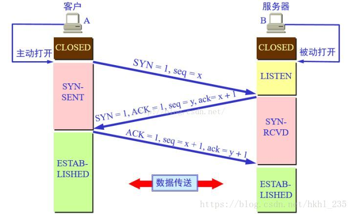
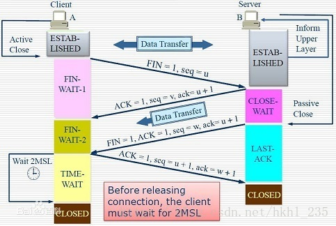
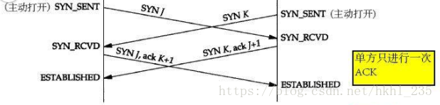
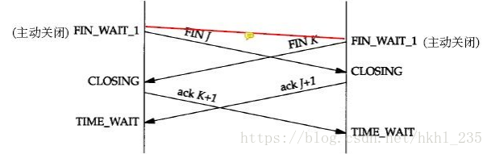

# TCP

## 状态迁移

```java
LISTEN：侦听来自远方的TCP端口的连接请求 //表示服务器端的某个SOCKET处于监听状态，可以接受连接
SYN-SENT：在发送连接请求后等待匹配的连接请求（客户端）//表示发送了SYN报文
SYN-RECEIVED：再收到和发送一个连接请求后等待对方对连接请求的确认（服务器）//表示接受到了SYN报文
ESTABLISHED：代表一个打开的连接//表示连接已经建立
FIN-WAIT-1：等待远程TCP连接中断请求，或先前的连接中断请求的确认//表示发送了FIN报文，等待服务端ACK确认
FIN-WAIT-2：从远程TCP等待连接中断请求//表示已接收到服务端ACK确认，等待服务端发送FIN报文
CLOSE-WAIT：等待从本地用户发来的连接中断请求//表示发送了FIN报文，等待客户端ACK确认
CLOSING：等待远程TCP对连接中断的确认//同时关闭连接，都已发送FIN报文，等待对方确认
LAST-ACK：等待原来的发向远程TCP的连接中断请求的确认//表示发送了FIN报文，等待服务端ACK确认即可进入CLOSED状态
TIME-WAIT：等待足够的时间以确保远程TCP接收到连接中断请求的确认//表示收到了对方的FIN报文，并发送出了ACK报文，就等2MSL后即可回到CLOSED可用状态了
CLOSED：没有任何连接状态//初始状态
```

### 客户端

```
CLOSED->SYN_SENT->ESTABLISHED->FIN_WAIT_1->FIN_WAIT_2->TIME_WAIT->CLOSED
```

### 服务端

```
CLOSED->LISTEN->SYN_RCVD ->ESTABLISHED->CLOSE_WAIT->LAST_ACK->CLOSED
```

> 当客户端开始连接时，服务器还处于LISTENING，
>
> 客户端发一个SYN包后，他就处于SYN_SENT状态,服务器就处于SYN_RCVD状态,
>
> 然后互相确认进入连接状态ESTABLISHED.
>
> 当客户端请求关闭连接时,客户端发送一个FIN包后,客户端就进入FIN_WAIT_1状态,等待对方的确认包,
>
> 服务器发送一个ACK包给客户,客户端收到ACK包后结束FIN_WAIT_1状态,进入FIN_WAIT_2状态,等待服务器发过来的关闭请求,
>
> 服务器发一个FIN包后,进入CLOSE_WAIT状态,
>
> 当客户端收到服务器的FIN包,FIN_WAIT_2状态就结束,然后给服务器端的FIN包给以一个确认包,客户端这时进入TIME_WAIT,
>
> 当服务器收到确认包后,CLOSE_WAIT状态结束了,
>
> 这时候服务器端真正的关闭了连接.但是客户端还在TIME_WAIT状态下,
>
> 什么时候结束呢.我在这里再讲到一个新名词:2MSL等待状态,其实TIME_WAIT就是2MSL等待状态,
>
> 注：主动关闭的Socket端会进入TIME_WAIT状态，并且持续2MSL时间长度，MSL就是maximum segment lifetime(最大分节生命期），这是一个IP数据包能在互联网上生存的最长时间，超过这个时间将在网络中消失。MSL在RFC 1122上建议是2分钟，而源自berkeley的TCP实现传统上使用30秒，因而，TIME_WAIT状态一般维持在1-4分钟。
>
> 为什么要设置这个状态,原因是有足够的时间让ACK包到达服务器端,如果服务器端没收到ACK包，超时了，然后重新发一个FIN包，直到服务器收到ACK 包

## 建立连接

### 流程

> TCP建立连接（三次握手），TCP连接的建立采用客户-服务器模式：主动发起连接建立的应用进程叫做客户，被动等待连接建立的应用进程叫做服务器

1. 客户端发起建立连接请求,发送SYN包给服务器，客户端处于`SYN_SENT`状态，服务端处于`LISTEN`状态

2. 服务端接收到客户端的SYN包，返回ACK确认和SYN包，询问客户端是否准备好建立数据连接，服务端处于`SYN_RCVD`状态，客户端处于`SYN_SENT`状态

3. 客户端接收到服务端的ACK确认报文和SYN包，返回ACK确认报文，客户端处于`ESTABLISHED`状态，服务端接收到ACK确认报文后，服务端处于`ESTABLISHED`状态

   

## 断开连接

### 流程

> tcp连接终止协议（tcp四挥手）。由于TCP连接是全双工的，因此每个方向都必须单独进行关闭。这原则是当一方完成它的数据发送任务后就能发送一个FIN来终止这个方向的连接。收到一个 FIN只意味着这一方向上没有数据流动，一个TCP连接在收到一个FIN后仍能发送数据。首先进行关闭的一方将执行主动关闭，而另一方执行被动关闭。

1. TCP客户端发送一个FIN报文到服务端，用来关闭客户到服务器的数据传送。
2. 服务器收到这个FIN，它发回一个ACK，确认序号为收到的序号加1。和SYN一样，一个FIN将占用一个序号。
3. 服务器关闭客户端的连接，发送一个FIN给客户端。
4. 客户端发回ACK报文确认，并将确认序号设置为收到序号加1。



## 特殊情形

> 这种状态比较特殊，实际情况中应该是很少见，属于一种比较罕见的例外状态。正常情况下，当你发送FIN报文后，按理来说是应该先收到（或同时收到）对方的ACK报文，再收到对方的FIN报文。但是CLOSING状态表示你发送FIN报文后，并没有收到对方的ACK报文，反而却也收到了对方的FIN报文。什么情况下会出现此种情况呢？其实细想一下，也不难得出结论：那就是如果双方几乎在同时close一个SOCKET的话，那么就出现了双方同时发送FIN报文的情况，也就会出现CLOSING状态，表示双方都正在关闭SOCKET连接

### 同时连接



### 同时关闭



